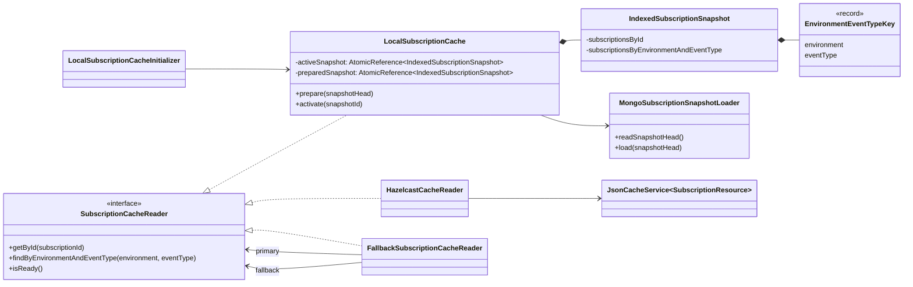
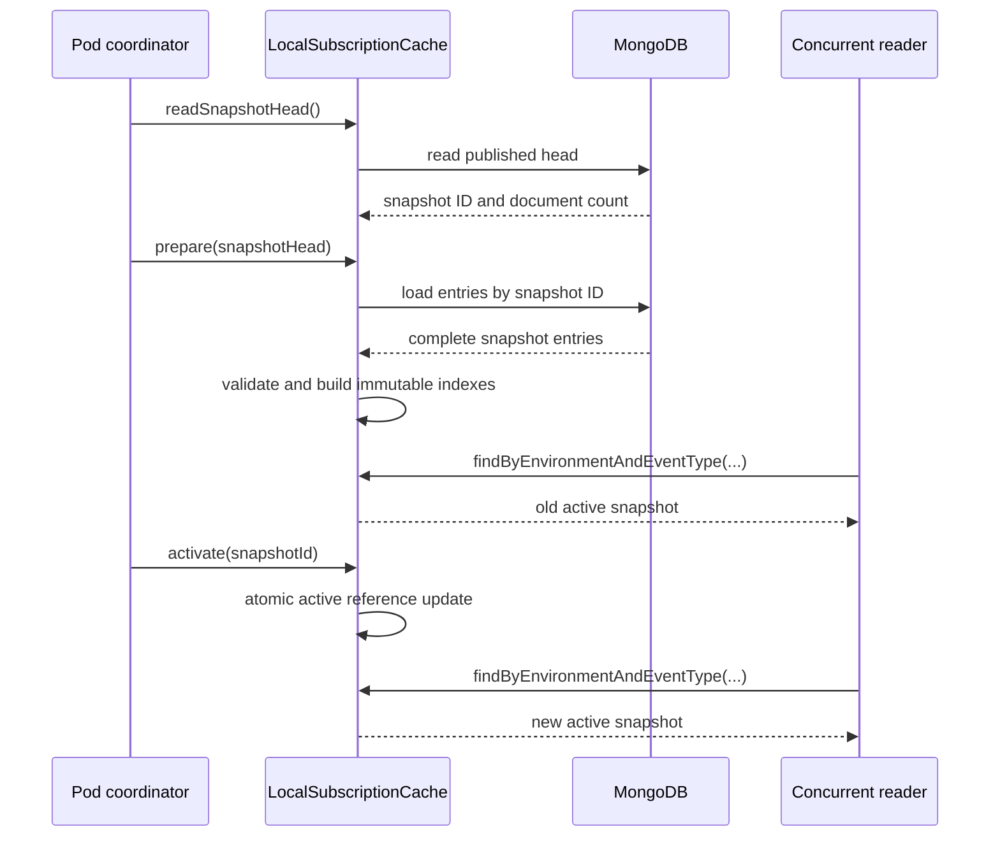

<!--
Copyright 2026 Deutsche Telekom AG

SPDX-License-Identifier: Apache-2.0
-->

# Local Subscription Cache

## Purpose

`LocalSubscriptionCache` provides a pod-local read cache for subscriptions. It prepares indexed lookup structures without
changing the active cache, then publishes the new state with one atomic reference update. It loads persisted snapshots
through `MongoSubscriptionSnapshotLoader`.

The existing Hazelcast-backed `JsonCacheService<SubscriptionResource>` remains unchanged. The Spring Boot autoconfiguration
selects the local cache as primary when enabled and can retain the existing service as fallback.

Applications access subscriptions through `SubscriptionCacheReader`. Its intentionally limited API exposes lookups by
subscription ID and by environment plus event type. The Shared Cache implementation translates the latter into a Hazelcast
`Query`; additional query shapes require an explicit implementation for every cache variant.

## Architecture



Each snapshot contains two indexes:

| Index | Key | Value | Purpose |
|---|---|---|---|
| `subscriptionsById` | `subscriptionId` | one `SubscriptionResource` | Direct lookup by subscription ID |
| `subscriptionsByEnvironmentAndEventType` | `EnvironmentEventTypeKey(environment, eventType)` | list of `SubscriptionResource` | Lookup for event processing |

The maps and query result lists are structurally immutable. They cannot be changed through the cache API. The contained
`SubscriptionResource` objects are loaded from the MongoDB snapshot entries and remain mutable model objects; consumers
must treat them as read-only.

## Lifecycle

### Initial state

The active snapshot is empty after construction. When the local cache is enabled, the auto-configured initializer loads and
activates the first snapshot during application startup.

- With a configured fallback, an initialization failure is logged and the shared cache can serve requests.
- With fallback mode `NONE`, the initialization exception is propagated and application startup fails.
- An empty snapshot is rejected by `activate()`; the previous active snapshot remains unchanged.

### Prepare

Calling `prepare(snapshotHead)` performs the following steps:

1. Load all entries for the snapshot identified by the published head.
2. Validate every document.
3. Build the ID and environment/event-type indexes in local temporary maps.
4. Convert the maps and lists to unmodifiable collections.
5. Store the completed snapshot as `preparedSnapshot`.

The active snapshot is not modified during this process. If loading, validation, or index construction fails, readers continue
to use the previous active snapshot. A later successful `prepare()` replaces an earlier prepared snapshot. Preparation is
skipped only when all snapshot-head fields match the prepared snapshot. Changes to fields such as `revision`, `sourceHash`,
or `documentCount` trigger a reload even when the `snapshotId` remains unchanged.

### Activate

Calling `activate(snapshotId)` verifies that the prepared snapshot has the expected ID and publishes it through the
`activeSnapshot` `AtomicReference`.



Activation without a prepared snapshot throws `IllegalStateException`. Empty snapshots are rejected as well. A prepared
snapshot remains available after activation. Repeated activation is idempotent only when all snapshot-head metadata is
unchanged; the same snapshot ID with changed metadata publishes the newly prepared snapshot.

## Read API

```java
Optional<SubscriptionResource> getById(String subscriptionId);

List<SubscriptionResource> findByEnvironmentAndEventType(
        String environment,
        String eventType
);
```

Reads:

- use only the current in-memory active snapshot;
- never access MongoDB or Hazelcast;
- do not acquire locks;
- observe either the complete old snapshot or the complete new snapshot;
- return empty results for unknown keys or `null` arguments.

Expected lookup complexity is $O(1)$ for both indexes, excluding iteration over the returned query result list.

## Validation and failure behavior

Preparation rejects:

- a `null` document;
- missing `spec` or `spec.subscription`;
- missing subscription ID;
- missing environment;
- missing event type;
- duplicate subscription IDs.

Any such failure prevents the new snapshot from becoming prepared. The active snapshot remains available and unchanged.

## Spring Boot integration

`LocalSubscriptionCacheAutoConfiguration` creates the cache only when the local cache is enabled. It requires the qualified
`mongoConfigTemplate` bean to read the snapshot head and entries.

MongoDB is normally enabled with:

```yaml
horizon:
  mongo:
    enabled: true
```

The bean is registered in addition to the existing `JsonCacheService`. A custom `LocalSubscriptionCache` or
`LocalSubscriptionCacheInitializer` bean overrides the corresponding auto-configured bean.

Enable the cache and optional snapshot-head polling with:

```yaml
horizon:
    cache:
        local-subscription-cache:
            enabled: true
            fallback-mode: hazelcast-with-mongo-fallback
            snapshot-collection: subscriptions.subscriber.horizon.telekom.de.v1-snapshots
            head-collection: subscriptions.subscriber.horizon.telekom.de.v1-head
            head-polling:
                enabled: true
                interval: 30s
```

The initializer performs the initial `prepare()` and `activate()` automatically. When head polling is enabled, it periodically
reads the published snapshot head and atomically activates a newly prepared snapshot. Unchanged heads are ignored, empty
snapshots are rejected, and load failures preserve the active snapshot.

When `local-subscription-cache.enabled` is `false`, no local-cache bean is created. The regular shared
`JsonCacheService` remains responsible for reads and its configured MongoDB fallback is used when Hazelcast is unavailable.

## Guarantees and boundaries

The implementation guarantees:

- atomic publication inside one pod;
- no partially built snapshot is visible to readers;
- lock-free in-memory reads;
- preservation of the previous active snapshot when preparation fails;
- rejection of empty snapshots before they become active;
- no behavioral change to `JsonCacheService`.

The implementation does not provide:

- cross-pod activation coordination;
- checksum or activation-time handling;
- deep immutability of `SubscriptionResource` objects;
- fallback based on snapshot freshness after a previously successful activation.

These concerns remain with the consuming pod or a future coordination component.