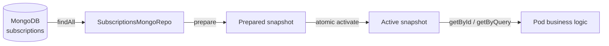
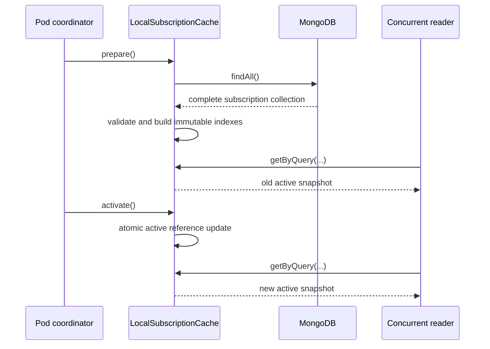

<!--
Copyright 2026 Deutsche Telekom AG

SPDX-License-Identifier: Apache-2.0
-->

# Local Subscription Cache

## Purpose

`LocalSubscriptionCache` provides a pod-local read cache for subscriptions. It loads a complete subscription snapshot from
MongoDB, prepares indexed lookup structures without changing the active cache, and publishes the new state with one atomic
reference update.

The existing Hazelcast-backed `JsonCacheService<SubscriptionResource>` remains unchanged. The Spring Boot autoconfiguration
selects the local cache as primary when enabled and can retain the existing service as fallback.

## Architecture



Each snapshot contains two indexes:

| Index | Key | Value | Purpose |
|---|---|---|---|
| `byId` | `subscriptionId` | one `SubscriptionResource` | Direct lookup by subscription ID |
| `byQuery` | `(environment, eventType)` | list of `SubscriptionResource` | Lookup for event processing |

The maps and query result lists are structurally immutable. They cannot be changed through the cache API. The contained
`SubscriptionResource` objects are the objects returned by the MongoDB repository and remain mutable model objects; consumers
must treat them as read-only.

## Lifecycle

### Initial state

The active snapshot is empty after construction. When the local cache is enabled, the autoconfigured initializer loads and
activates the first snapshot during application startup. If initialization fails, health remains down and the configured
fallback remains available.

### Prepare

Calling `prepare()` performs the following steps:

1. Load the complete collection with `SubscriptionsMongoRepo.findAll()`.
2. Validate every document.
3. Build the ID and query indexes in local temporary maps.
4. Convert the maps and lists to unmodifiable collections.
5. Store the completed snapshot as `preparedSnapshot`.

The active snapshot is not modified during this process. If loading, validation, or index construction fails, readers continue
to use the previous active snapshot. A later successful `prepare()` replaces an earlier prepared snapshot.

### Activate

Calling `activate()` removes the current prepared snapshot from its slot and publishes it through the `activeSnapshot`
`AtomicReference`.



Activation without a prepared snapshot throws `IllegalStateException`. A prepared snapshot can be activated only once.

## Read API

```java
Optional<SubscriptionResource> getById(String subscriptionId);

List<SubscriptionResource> getByQuery(
        String environment,
        String eventType
);
```

Reads:

- use only the current in-memory active snapshot;
- never access MongoDB or Hazelcast;
- do not acquire locks;
- observe either the complete old snapshot or the complete new snapshot;
- return empty results for unknown keys or `null` arguments.

Expected lookup complexity is $O(1)$ for both indexes, excluding iteration over the returned query result list.

## Validation and failure behavior

Preparation rejects:

- a `null` document;
- missing `spec` or `spec.subscription`;
- missing subscription ID;
- missing environment;
- missing event type;
- duplicate subscription IDs.

Any such failure prevents the new snapshot from becoming prepared. The active snapshot remains available and unchanged.

## Spring Boot integration

`LocalSubscriptionCacheAutoConfiguration` creates the cache when a `SubscriptionsMongoRepo` bean is available. This is
normally the case when MongoDB is enabled:

```yaml
horizon:
  mongo:
    enabled: true
```

The bean is registered in addition to the existing `JsonCacheService`. A custom `LocalSubscriptionCache` or
`LocalSubscriptionCacheInitializer` bean overrides the corresponding auto-configured bean.

Enable the cache and optional snapshot-head polling with:

```yaml
horizon:
    cache:
        local-subscription-cache:
            enabled: true
            fallback-mode: shared-cache-mongo
            snapshot-collection: subscriptions.subscriber.horizon.telekom.de.v1-snapshots
            head-collection: subscriptions.subscriber.horizon.telekom.de.v1-head
            head-polling:
                enabled: true
                interval: 30s
```

The initializer performs the initial `prepare()` and `activate()` automatically. When head polling is enabled, it periodically
reads the published snapshot head and atomically activates a newly prepared snapshot. Unchanged heads are ignored, and load
failures preserve the active snapshot.

## Guarantees and boundaries

The implementation guarantees:

- atomic publication inside one pod;
- no partially built snapshot is visible to readers;
- lock-free in-memory reads;
- preservation of the previous active snapshot when preparation fails;
- no behavioral change to `JsonCacheService`.

The implementation does not provide:

- cross-pod activation coordination;
- checksum or activation-time handling;
- deep immutability of `SubscriptionResource` objects;
- fallback based on snapshot freshness after a previously successful activation.

These concerns remain with the consuming pod or a future coordination component.

## Tests

The test suite covers:

- preparation and atomic activation;
- repeated preparation and activation;
- replacement of an existing prepared snapshot;
- reads before the first activation;
- invalid and unknown lookup arguments;
- invalid documents and duplicate IDs;
- preservation of the active snapshot after preparation failure;
- concurrent readers observing only complete snapshots;
- coexistence with `JsonCacheService` in the Spring context;
- replacement by an application-provided snapshot cache bean.

Run the verification with:

```shell
./gradlew test
./gradlew check
```