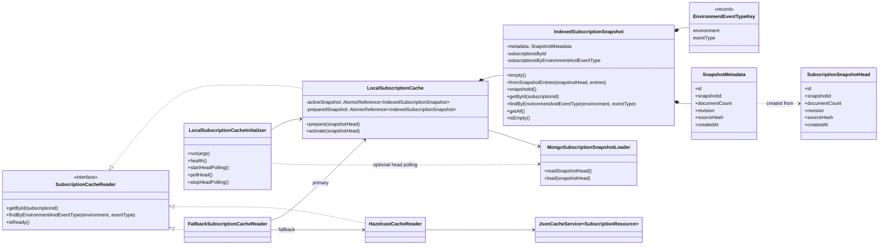
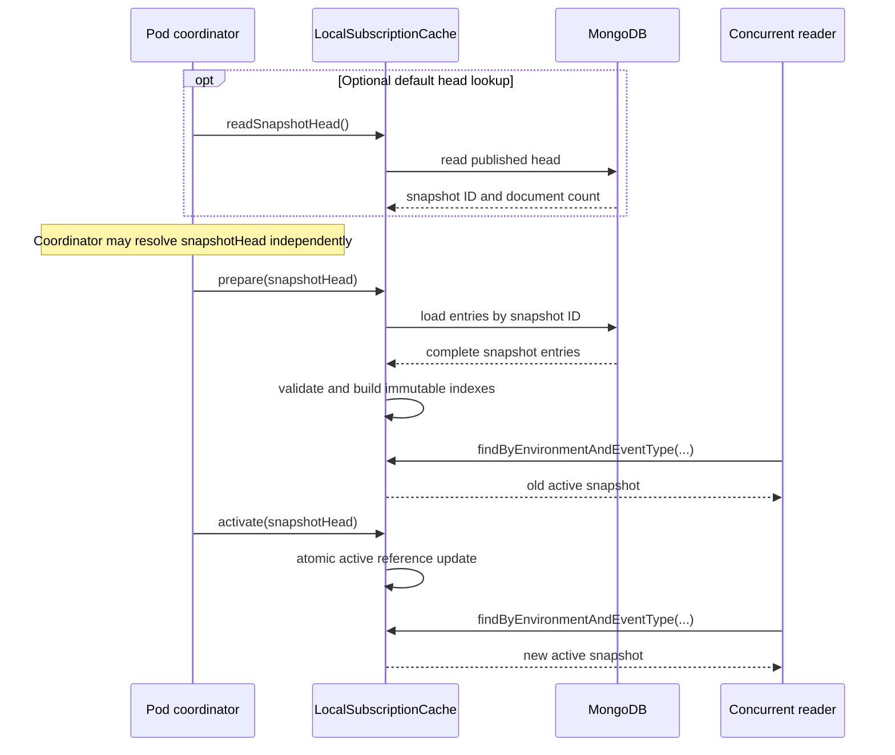

<!--
Copyright 2026 Deutsche Telekom AG

SPDX-License-Identifier: Apache-2.0
-->

# Local Subscription Cache

## Purpose

`LocalSubscriptionCache` provides a pod-local read cache for subscriptions. It prepares indexed lookup structures without
changing the active cache, then publishes the new state with one atomic reference update. It loads persisted snapshots
through `MongoSubscriptionSnapshotLoader`.

The existing Hazelcast-backed `JsonCacheService<SubscriptionResource>` remains unchanged. The Spring Boot autoconfiguration
selects the local cache as primary when enabled and can retain the existing service as fallback.

Applications access subscriptions through `SubscriptionCacheReader`. Its intentionally limited API exposes lookups by
subscription ID and by environment plus event type. The Shared Cache implementation translates the latter into a Hazelcast
`Query`; additional query shapes require an explicit implementation for every cache variant.

## Architecture



`LocalSubscriptionCache` verwaltet `IndexedSubscriptionSnapshot`-Instanzen und hält dabei zwei Referenzen:

- `preparedSnapshot` enthält den neu geladenen und validierten Snapshot. Er ist für Leser noch nicht sichtbar.
- `activeSnapshot` enthält den aktuell veröffentlichten Snapshot, den die Leseoperationen verwenden.

`prepare(snapshotHead)` erstellt aus den Snapshot-Einträgen einen neuen `IndexedSubscriptionSnapshot` mit den vorbereiteten
Lookup-Indizes. `activate(snapshotHead)` veröffentlicht diesen vorbereiteten Snapshot anschließend atomar als aktiven Snapshot.
`IndexedSubscriptionSnapshot` selbst entscheidet nicht über den Lebenszyklus und wird nach seiner Erstellung nicht mehr verändert.
Dadurch können Leser während des Vorbereitens weiterhin den alten vollständigen Snapshot verwenden und sehen nach der Aktivierung
entweder den vollständigen alten oder den vollständigen neuen Snapshot.

The `LocalSubscriptionCacheInitializer` always performs the initial snapshot loading during startup. The recurring `pollHead()`
execution is optional and is started only when the pod configuration sets `head-polling.enabled: true`. During polling it obtains a
`SubscriptionSnapshotHead`, calls `prepare(snapshotHead)`, and activates the prepared snapshot with `activate(snapshotHead)`. The
head may be obtained through the default cache method or by a custom coordinator implementation; polling is not part of the reader
API itself.

The `LocalSubscriptionCacheInitializer` provides the following coordinator responsibilities:

| Method | Responsibility |
|---|---|
| `run(args)` | Performs the initial head lookup, preparation, activation, and starts optional polling. |
| `health()` | Reports `UP` when the local cache or an enabled fallback reader is ready; otherwise reports `DOWN`. |
| `startHeadPolling()` | Optional polling lifecycle operation. It is called only when the pod configuration enables `head-polling.enabled: true` and starts the scheduled executor. |
| `pollHead()` | Optional recurring polling operation. It reads a new head, prepares the corresponding snapshot, and activates it when a pending snapshot exists. A polling failure preserves the active snapshot. |
| `stopHeadPolling()` | Optional polling lifecycle operation. It stops the scheduled polling executor during application shutdown when polling was enabled. |

The initializer coordinates the snapshot lifecycle but does not provide subscription lookup methods itself. Readers use
`SubscriptionCacheReader`, which delegates local lookups to the currently active snapshot.

Each snapshot contains two indexes:

| Index | Key | Value | Purpose |
|---|---|---|---|
| `subscriptionsById` | `subscriptionId` | one `SubscriptionResource` | Direct lookup by subscription ID |
| `subscriptionsByEnvironmentAndEventType` | `EnvironmentEventTypeKey(environment, eventType)` | list of `SubscriptionResource` | Lookup for event processing |

The maps and query result lists are structurally immutable. They cannot be changed through the cache API. The contained
`SubscriptionResource` objects are loaded from the MongoDB snapshot entries and remain mutable model objects; consumers
must treat them as read-only.

## Lifecycle

### Initial state

The active snapshot is empty after construction. When the local cache is enabled, the auto-configured initializer loads and
activates the first snapshot during application startup.

- With a configured fallback, an initialization failure is logged and the shared cache can serve requests.
- With fallback mode `NONE`, the initialization exception is propagated and application startup fails.
- An empty snapshot is rejected by `activate(snapshotHead)`; the previous active snapshot remains unchanged.

### Prepare

Calling `prepare(snapshotHead)` performs the following steps:

1. Load all entries for the snapshot identified by the published head.
2. Validate every document.
3. Build the ID and environment/event-type indexes in local temporary maps.
4. Convert the maps and lists to unmodifiable collections.
5. Store the completed snapshot as `preparedSnapshot`.

The active snapshot is not modified during this process. If loading, validation, or index construction fails, readers continue
to use the previous active snapshot. A later successful `prepare()` replaces an earlier prepared snapshot. Preparation is
skipped only when all snapshot-head fields match the prepared snapshot. Changes to fields such as `revision`, `sourceHash`,
or `documentCount` trigger a reload even when the `snapshotId` remains unchanged.

### How the coordinator obtains the snapshot head

The coordinator must obtain a complete and valid `SubscriptionSnapshotHead` before calling `prepare(snapshotHead)`. The head is the
published commit marker for the snapshot and contains more than the snapshot ID, including the expected `documentCount`, `revision`,
and `sourceHash`.

The provided initializer uses `LocalSubscriptionCache.readSnapshotHead()` as one way to read and validate the head from MongoDB. This
method is optional for the coordinator contract, however. A coordinator may resolve the head through its own method or another trusted
source and then call `prepare(snapshotHead)` directly. `prepare()` does not discover the current snapshot itself; it loads and validates
the exact head supplied by the caller.

Regardless of how the head is obtained, the lifecycle remains:

1. Obtain and validate the currently published `snapshotHead`.
2. `prepare(snapshotHead)` loads that snapshot and verifies its entry count before building indexes.
3. `activate(snapshotHead)` publishes the prepared snapshot to readers.

The coordinator must not use a hard-coded or stale snapshot ID as a substitute for the current head. Otherwise it could load an
outdated snapshot, miss metadata changes for a reused snapshot ID, or skip the document-count consistency check against the published
head.

### Activate

Calling `activate(snapshotHead)` verifies that the complete prepared metadata matches the supplied head and publishes it through
the `activeSnapshot` `AtomicReference`. Passing the complete head keeps preparation and activation tied to the same snapshot version;
comparing only the snapshot ID would not detect changed metadata for a reused ID.



Activation without a prepared snapshot throws `IllegalStateException`. Empty snapshots are rejected as well. A prepared
snapshot remains available after activation. Repeated activation is idempotent only when all snapshot-head metadata is
unchanged; the same snapshot ID with changed metadata publishes the newly prepared snapshot.

## Read API

```java
Optional<SubscriptionResource> getById(String subscriptionId);

List<SubscriptionResource> findByEnvironmentAndEventType(
        String environment,
        String eventType
);
```

Reads:
- use only the current in-memory active snapshot;
- never access MongoDB or Hazelcast;
- do not acquire locks;
- observe either the complete old snapshot or the complete new snapshot;
- return empty results for unknown keys or `null` arguments.

Expected lookup complexity is $O(1)$ for both indexes, excluding iteration over the returned query result list.

## Validation and failure behavior

Preparation rejects:

- a `null` document;
- missing `spec` or `spec.subscription`;
- missing subscription ID;
- missing environment;
- missing event type;
- duplicate subscription IDs.

Any such failure prevents the new snapshot from becoming prepared. The active snapshot remains available and unchanged.

## Spring Boot integration

`LocalSubscriptionCacheAutoConfiguration` creates the cache only when the local cache is enabled. It requires the qualified
`mongoConfigTemplate` bean to read the snapshot head and entries.

MongoDB is normally enabled with:

```yaml
horizon:
  mongo:
    enabled: true
```

The bean is registered in addition to the existing `JsonCacheService`. A custom `LocalSubscriptionCache` or
`LocalSubscriptionCacheInitializer` bean overrides the corresponding auto-configured bean.

Enable the cache and optional snapshot-head polling with:

```yaml
horizon:
    cache:
        local-subscription-cache:
            enabled: true
            fallback-mode: hazelcast-with-mongo-fallback
            snapshot-collection: subscriptions.subscriber.horizon.telekom.de.v1-snapshots
            head-collection: subscriptions.subscriber.horizon.telekom.de.v1-head
            head-polling:
                enabled: true
                interval: 30s
```

The initializer performs the initial `prepare(snapshotHead)` and `activate(snapshotHead)` automatically. When the pod configuration
sets `head-polling.enabled: true`, it additionally obtains the published snapshot head periodically and atomically activates a newly
prepared snapshot. If polling is disabled or not configured, no recurring `pollHead()` execution is started. Unchanged heads are
ignored, empty snapshots are rejected, and load failures preserve the active snapshot. A custom coordinator may supply the head
itself while using the same `prepare(snapshotHead)` and `activate(snapshotHead)` contract.

### Runtime scenarios

| Scenario | Local cache | Hazelcast/MongoDB fallback | Application startup | Health and readiness |
|---|---|---|---|---|
| Local snapshot loads and activates successfully | Ready | Not required | Succeeds | `UP`, source `local`; pod is ready |
| Local snapshot initialization fails, fallback is disabled (`NONE`) | Not ready | Not used | Fails | Pod does not become ready |
| Local snapshot initialization fails, fallback is available | Not ready | Ready through Hazelcast or MongoDB | Succeeds | `UP`, source `fallback`; pod is ready |
| Local cache is active, polling finds an unchanged head | Ready | Not required | Already running | Remains `UP`, source `local` |
| Local cache is active, polling activates a new snapshot | Ready | Not required | Already running | Remains `UP`, source `local` |
| Polling fails while an active local snapshot exists | Ready with previous snapshot | Not required | Already running | Remains `UP`, source `local`; previous snapshot is preserved |
| Local cache is not ready and all fallback checks fail | Not ready | Not ready | Depends on startup result | `DOWN`; pod is not ready |

### `prepare` and `activate` scenarios

The runtime scenarios above describe the complete pod behavior. The following table focuses on the two cache operations executed by
the pod coordinator:

| Operation | Scenario | Result | Active snapshot |
|---|---|---|---|
| `prepare` | Valid head and complete entries are available | Snapshot is validated, indexed, and stored as `preparedSnapshot` | Unchanged |
| `prepare` | Same head metadata is already prepared | Preparation is skipped | Unchanged |
| `prepare` | Same snapshot ID but changed metadata | Snapshot is loaded and prepared again | Unchanged |
| `prepare` | Invalid head, invalid entry, duplicate ID, or document-count mismatch | Operation fails; prepared snapshot is not replaced | Unchanged |
| `activate` | Prepared snapshot matches the complete supplied head and is non-empty | Prepared snapshot becomes active atomically | New snapshot |
| `activate` | No prepared snapshot exists | Operation fails with `IllegalStateException` | Unchanged |
| `activate` | Prepared snapshot does not match the supplied head | Operation fails with `IllegalStateException` | Unchanged |
| `activate` | Prepared snapshot is empty | Operation fails with `SubscriptionCacheSnapshotException` | Unchanged |
| `activate` | Supplied head matches the already active snapshot | Operation is idempotent | Unchanged |

When `local-subscription-cache.enabled` is `false`, no local-cache bean is created. The regular shared
`JsonCacheService` remains responsible for reads and its configured MongoDB fallback is used when Hazelcast is unavailable.

## Guarantees and boundaries

The implementation guarantees:

- atomic publication inside one pod;
- no partially built snapshot is visible to readers;
- lock-free in-memory reads;
- preservation of the previous active snapshot when preparation fails;
- rejection of empty snapshots before they become active;
- no behavioral change to `JsonCacheService`.

The implementation does not provide:

- cross-pod activation coordination;
- checksum or activation-time handling;
- deep immutability of `SubscriptionResource` objects;
- fallback based on snapshot freshness after a previously successful activation.

These concerns remain with the consuming pod or a future coordination component.