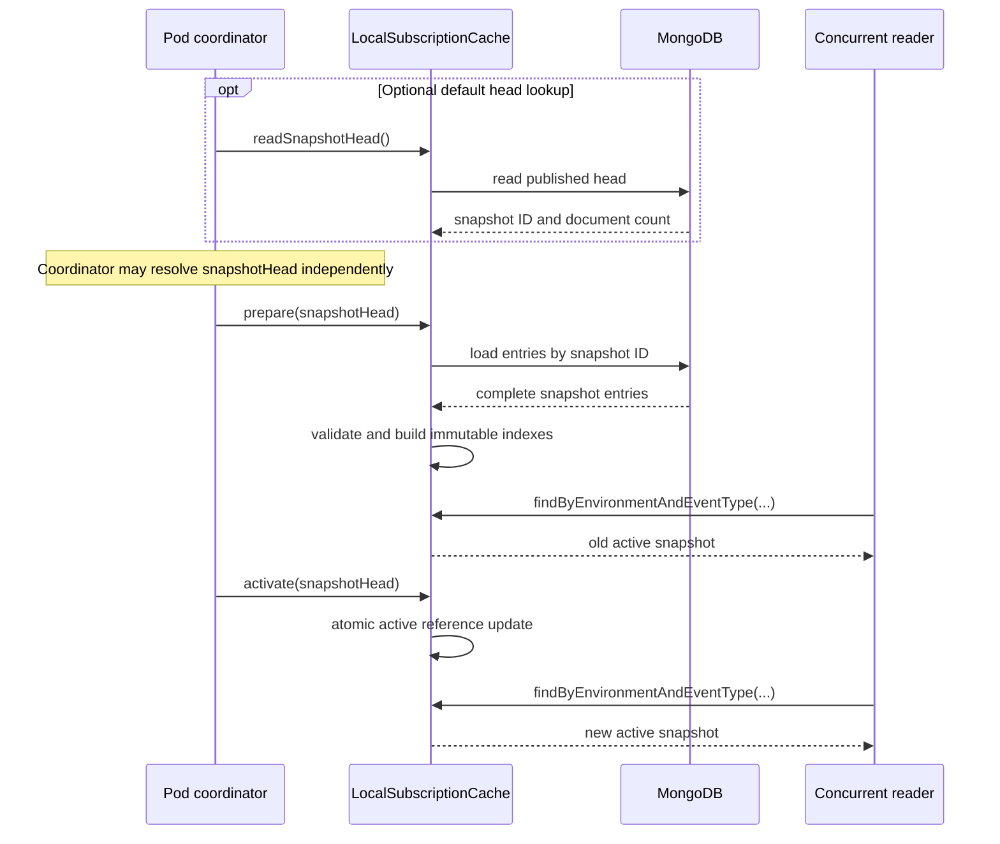
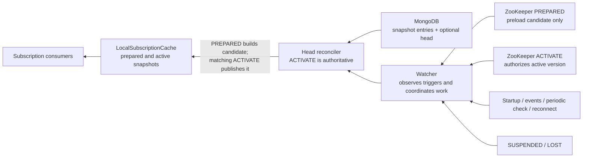
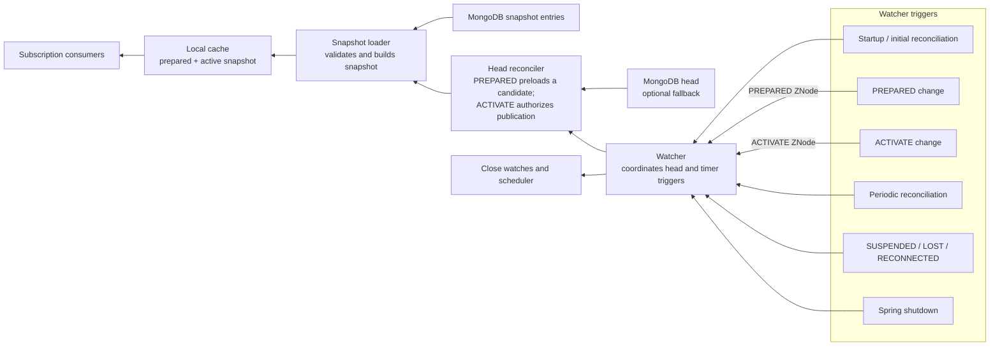

<!--
Copyright 2026 Deutsche Telekom AG

SPDX-License-Identifier: Apache-2.0
-->

# Local Subscription Cache

> **Document status:** This is the authoritative reference for the current local subscription cache behavior and configuration. The historical design plan in [local-subscription-cache-variant-2-plan.md](internal/local-subscription-cache-variant-2-plan.md) is superseded and is not normative. Outstanding operational follow-ups are tracked in [local-subscription-cache-open-items.md](internal/local-subscription-cache-open-items.md).

## Purpose

`LocalSubscriptionCache` provides a pod-local read cache for subscriptions. It prepares indexed lookup structures without
changing the active cache, then publishes the new state with one atomic reference update. It loads persisted snapshots
through `MongoSubscriptionSnapshotLoader`.

The existing Hazelcast-backed `JsonCacheService<SubscriptionResource>` remains unchanged. The Spring Boot autoconfiguration
selects the local cache as primary when enabled and can retain the existing service as fallback.

Applications access subscriptions through `SubscriptionCacheReader`. Its intentionally limited API exposes lookups by
subscription ID and by environment plus event type. The Shared Cache implementation translates the latter into a Hazelcast
`Query`; additional query shapes require an explicit implementation for every cache variant.

## Architecture

The class diagram below shows the main cache and reconciliation components.


```mermaid
classDiagram
    direction LR

    class SubscriptionCacheReader {
        <<interface>>
        +getById(subscriptionId)
        +findByEnvironmentAndEventType(environment, eventType)
        +isReady()
    }
    class LocalSubscriptionCache {
        -activeSnapshot: AtomicReference~IndexedSubscriptionSnapshot~
        -preparedSnapshot: AtomicReference~IndexedSubscriptionSnapshot~
        +prepare(snapshotHead)
        +activate(snapshotHead)
    }
    class HazelcastCacheReader
    class FallbackSubscriptionCacheReader
    class IndexedSubscriptionSnapshot {
        -metadata: SnapshotMetadata
        -subscriptionsById
        -subscriptionsByEnvironmentAndEventType
        +empty()
        +fromSnapshotEntries(snapshotHead, entries)
        +snapshotId()
        +getById(subscriptionId)
        +findByEnvironmentAndEventType(environment, eventType)
        +getAll()
        +isEmpty()
    }
    class SnapshotMetadata {
        +id
        +snapshotId
        +documentCount
        +revision
        +sourceHash
        +createdAt
    }
    class SubscriptionSnapshotHead {
        +id
        +snapshotId
        +documentCount
        +revision
        +sourceHash
        +createdAt
    }
    class EnvironmentEventTypeKey {
        <<record>>
        environment
        eventType
    }
    class MongoSubscriptionSnapshotLoader {
        +readSnapshotHead()
        +load(snapshotHead)
    }
    class JsonCacheService~SubscriptionResource~
    class LocalSubscriptionCacheHealthIndicator {
        +health()
    }
    class ZooKeeperSubscriptionHeadWatcher {
        +start()
        +close()
    }
    class ZooKeeperSubscriptionSnapshotHeadReader {
        +readPrepared()
        +readActivate()
        +parsePreparedEvent(data)
    }
    class ZooKeeperSubscriptionSnapshotHeadParser {
        +parse(data)
    }
    class ZooKeeperSubscriptionHeadReconciler {
        +run()
        +reconcileActiveHead()
        +reconcileFromMongoHead()
    }
    class MongoSubscriptionHeadReconciler {
        +reconcile()
    }
    class MongoSubscriptionHeadPoller {
        +start()
        +close()
    }

    SubscriptionCacheReader <|.. LocalSubscriptionCache
    SubscriptionCacheReader <|.. HazelcastCacheReader
    SubscriptionCacheReader <|.. FallbackSubscriptionCacheReader
    LocalSubscriptionCache *-- IndexedSubscriptionSnapshot
    IndexedSubscriptionSnapshot *-- EnvironmentEventTypeKey
    IndexedSubscriptionSnapshot *-- SnapshotMetadata
    SnapshotMetadata ..> SubscriptionSnapshotHead : created from
    LocalSubscriptionCache --> MongoSubscriptionSnapshotLoader
    HazelcastCacheReader --> JsonCacheService~SubscriptionResource~
    FallbackSubscriptionCacheReader --> LocalSubscriptionCache : primary
    FallbackSubscriptionCacheReader --> HazelcastCacheReader : fallback
    LocalSubscriptionCacheHealthIndicator --> LocalSubscriptionCache
    ZooKeeperSubscriptionHeadWatcher --> ZooKeeperSubscriptionHeadReconciler : events, reconnect, periodic
    ZooKeeperSubscriptionHeadReconciler --> ZooKeeperSubscriptionSnapshotHeadReader : read heads
    ZooKeeperSubscriptionSnapshotHeadReader --> ZooKeeperSubscriptionSnapshotHeadParser : validate payload
    ZooKeeperSubscriptionHeadReconciler --> LocalSubscriptionCache : prepare/activate ZooKeeper head
    ZooKeeperSubscriptionHeadReconciler --> MongoSubscriptionHeadReconciler : head fallback
    MongoSubscriptionHeadPoller --> MongoSubscriptionHeadReconciler : startup, periodic
    MongoSubscriptionHeadReconciler --> LocalSubscriptionCache : prepare/activate MongoDB head
```

`LocalSubscriptionCache` verwaltet `IndexedSubscriptionSnapshot`-Instanzen und hält dabei zwei Referenzen:

- `preparedSnapshot` enthält den neu geladenen und validierten Snapshot. Er ist für Leser noch nicht sichtbar.
- `activeSnapshot` enthält den aktuell veröffentlichten Snapshot, den die Leseoperationen verwenden.

`prepare(snapshotHead)` erstellt aus den Snapshot-Einträgen einen neuen `IndexedSubscriptionSnapshot` mit den vorbereiteten
Lookup-Indizes. `activate(snapshotHead)` veröffentlicht diesen vorbereiteten Snapshot anschließend atomar als aktiven Snapshot.
`IndexedSubscriptionSnapshot` selbst entscheidet nicht über den Lebenszyklus und wird nach seiner Erstellung nicht mehr verändert.
Dadurch können Leser während des Vorbereitens weiterhin den alten vollständigen Snapshot verwenden und sehen nach der Aktivierung
entweder den vollständigen alten oder den vollständigen neuen Snapshot.

The ZooKeeper head watcher coordinates initialization and later updates through the `prepared` and `activate` heads.
It falls back to the MongoDB head only when the `activate` head cannot be determined and
`mongo-head-fallback-enabled` is `true`. With `zoo-keeper.enabled: false`, no ZooKeeper client is started; the
`MongoSubscriptionHeadPoller` activates the MongoDB head once at startup and then every `reconcile-interval`.

The `LocalSubscriptionCacheHealthIndicator` (endpoint `/actuator/health/localSubscriptionCache`) reports diagnostic
details and always returns `UP`, including when no subscription reader is ready. It does not change aggregate health
or pod probe behavior; `UP` alone is not proof that subscription reads are available.

| Method | Responsibility |
|---|---|
| `health()` | Always reports `UP`; details identify the effective reader (`local`, `fallback`, or `unavailable`). |

Health details, in this order:

| Detail | Meaning |
|---|---|
| `source` | `local`, `fallback`, or `unavailable`; health status remains `UP` in all cases |
| `fallbackMode` | Configured `fallback-mode` |
| `headSource` | `zookeeper` or `mongodb` (`zoo-keeper.enabled`) |
| `cacheStatus` | `UNINITIALIZED`, `FRESH`, or `STALE` |
| `localSnapshotId` | Active local snapshot; `none` before the first activation. Can be outdated when `source` is `fallback`. |
| `subscriptionCount` | Number of subscriptions in the active local snapshot |
| `activatedAt` | Last successful activation of the active snapshot, or `none` |
| `expectedSnapshotId` | Snapshot of the expected head; differs from `localSnapshotId` while the pod lags behind; `none` while no head source is available |
| `pendingSnapshotId` | Prepared snapshot that is not active yet, or `none` |
| `staleSince` | Only while `STALE`: time since when the cache is stale |
| `staleLocalReadsRemaining` | Only while `STALE` with `hazelcast-with-mongo-fallback`: remaining `stale-local-cache-read-grace-period` before reads use the fallback |

`LocalSubscriptionCacheMetrics` exposes the same state per pod as Prometheus metrics. Gauges are evaluated from
memory at scrape time; the counter is a single increment per fallback read.

| Metric | Type | Value |
|---|---|---|
| `horizon_local_subscription_cache_state` | Gauge | Current status: `0` = `UNINITIALIZED`, `1` = `STALE`, `2` = `FRESH` |
| `horizon_local_subscription_cache_local_reads` | Gauge | `1` if reads are served locally, `0` if the fallback is used |
| `horizon_local_subscription_cache_subscriptions` | Gauge | Subscriptions in the active snapshot |
| `horizon_local_subscription_cache_stale_seconds` | Gauge | Seconds since the cache became `STALE`, `0` otherwise |
| `horizon_local_subscription_cache_last_activation_timestamp_seconds` | Gauge | Epoch seconds of the last activation, `0` if none |
| `horizon_local_subscription_cache_snapshot_behind` | Gauge | `1` if an expected head is known and the active snapshot does not match it (snapshot identity rules, see below) |
| `horizon_local_subscription_cache_fallback_reads_total` | Counter | Reads served by the Hazelcast/MongoDB fallback (`hazelcast-with-mongo-fallback` only) |
| `horizon_local_subscription_cache_zookeeper_connected` | Gauge | `1` if the ZooKeeper head source is connected, otherwise `0` (ZooKeeper mode only) |
| `horizon_local_subscription_cache_failures_total{reason}` | Counter | `activation`: failed snapshot activations including failed snapshot loads; `zookeeper_head_read`: ZooKeeper `activate` head unreadable or missing while ZooKeeper is reachable (ZooKeeper mode only). Counts attempts, not incidents. |
| `horizon_local_subscription_cache_snapshot_load_seconds` | Timer | Count and total duration of successful snapshot loads from MongoDB |
| `horizon_local_subscription_cache_snapshot_load_last_seconds` | Gauge | Duration of the last successful snapshot load |

A Grafana dashboard for these metrics can be imported from
[local-subscription-cache-dashboard.json](local-subscription-cache-dashboard.json).

The initializer does not coordinate the snapshot lifecycle and does not provide subscription lookup methods. Readers use
`SubscriptionCacheReader`, which delegates local lookups to the currently active snapshot.

Each snapshot contains two indexes:

| Index | Key | Value | Purpose |
|---|---|---|---|
| `subscriptionsById` | `subscriptionId` | one `SubscriptionResource` | Direct lookup by subscription ID |
| `subscriptionsByEnvironmentAndEventType` | `EnvironmentEventTypeKey(environment, eventType)` | list of `SubscriptionResource` | Lookup for event processing |

The maps and query result lists are structurally immutable. They cannot be changed through the cache API. The contained
`SubscriptionResource` objects are loaded from the MongoDB snapshot entries and remain mutable model objects; consumers
must treat them as read-only.

## Lifecycle

### Initial state

The active snapshot is empty after construction. When the local cache is enabled, the ZooKeeper head watcher (or the
MongoDB head poller with ZooKeeper disabled) loads and activates the first snapshot during application startup; the
startup barrier decides whether startup waits for it.

- An empty snapshot is rejected by `activate(snapshotHead)`; the previous active snapshot remains unchanged.

### Prepare

Calling `prepare(snapshotHead)` performs the following steps:

1. Load all entries for the snapshot identified by the published head.
2. Validate every document.
3. Build the ID and environment/event-type indexes in local temporary maps.
4. Convert the maps and lists to unmodifiable collections.
5. Store the completed snapshot as `preparedSnapshot`.

The active snapshot is not modified during this process. If loading, validation, or index construction fails, readers continue
to use the previous active snapshot. A later successful `prepare()` replaces an earlier prepared snapshot. Preparation is
skipped when the head references the active or the prepared snapshot.

Head validation and identity (`SubscriptionSnapshotHeads`) apply to ZooKeeper and MongoDB heads alike:

| Field | Validation | Identity ("same snapshot") |
|---|---|---|
| `snapshotId` | required, not blank | always compared |
| `documentCount` | required, `> 0` | always compared |
| `revision` | optional | compared only when set on both heads |
| `sourceHash` | optional | compared only when set on both heads |
| `createdAt` | required; ZooKeeper accepts any ISO-8601 offset (`Z`, `+02:00`) | not compared |
| `id` and unknown fields | ignored | not compared |

`SnapshotVersion.matches` applies these pairwise identity rules. The record's `equals` and `hashCode` compare all
stored fields, including `createdAt`, and are not used for lifecycle matching.

A changed `revision` or `sourceHash` with an unchanged `snapshotId` therefore triggers a reload, while a field missing in one
source does not. Invalid heads raise `SubscriptionCacheSnapshotException`.

### Subscription mapping

All read paths produce identical `SubscriptionResource` objects: Hazelcast JSON, local snapshot entries, and the MongoDB
fallback (when Hazelcast is offline) are all mapped with the same Jackson configuration
(`SubscriptionResourceJsonMapper.createObjectMapper()`, including the JSON filter operator (de)serializers).
MongoDB documents are read as raw BSON and converted to plain JSON first: dates become ISO-8601 strings, `Int64` and
`Decimal128` become JSON numbers, `ObjectId` becomes a string, and the MongoDB `_id` is ignored. No Spring Data entity mapping
or custom MongoDB converters are involved. A document that cannot be mapped fails the load (snapshot) or the read (fallback).

### How the coordinator obtains the snapshot head

The coordinator must obtain a complete and valid `SubscriptionSnapshotHead` before calling `prepare(snapshotHead)`. The head is the
published commit marker for the snapshot and contains more than the snapshot ID, including the expected `documentCount`, `revision`,
and `sourceHash`.

`MongoSubscriptionHeadReconciler` uses `LocalSubscriptionCache.readSnapshotHead()` to read and validate the head from MongoDB;
the ZooKeeper reconciler reads the head from the `activate` ZNode instead. A coordinator may resolve the head through any
trusted source and then call `prepare(snapshotHead)` directly. `prepare()` does not discover the current snapshot itself; it
loads and validates the exact head supplied by the caller.

Regardless of how the head is obtained, the lifecycle remains:

1. Obtain and validate the currently published `snapshotHead`.
2. `prepare(snapshotHead)` loads that snapshot and verifies its entry count before building indexes.
3. `activate(snapshotHead)` publishes the prepared snapshot to readers.

The coordinator must not use a hard-coded or stale snapshot ID as a substitute for the current head. Otherwise it could load an
outdated snapshot, miss metadata changes for a reused snapshot ID, or skip the document-count consistency check against the published
head.

### Activate

Calling `activate(snapshotHead)` verifies that the complete prepared metadata matches the supplied head and publishes it through
the `activeSnapshot` `AtomicReference`. Passing the complete head keeps preparation and activation tied to the same snapshot version;
comparing only the snapshot ID would not detect changed metadata for a reused ID.


```mermaid
sequenceDiagram
    participant Coordinator as Pod coordinator
    participant Cache as LocalSubscriptionCache
    participant Mongo as MongoDB
    participant Reader as Concurrent reader

    opt Optional default head lookup
        Coordinator->>Cache: readSnapshotHead()
        Cache->>Mongo: read published head
        Mongo-->>Cache: snapshot ID and document count
    end
    Note over Coordinator: Coordinator may resolve snapshotHead independently
    Coordinator->>Cache: prepare(snapshotHead)
    Cache->>Mongo: load entries by snapshot ID
    Mongo-->>Cache: complete snapshot entries
    Cache->>Cache: validate and build immutable indexes
    Reader->>Cache: findByEnvironmentAndEventType(...)
    Cache-->>Reader: old active snapshot
    Coordinator->>Cache: activate(snapshotHead)
    Cache->>Cache: atomic active reference update
    Reader->>Cache: findByEnvironmentAndEventType(...)
    Cache-->>Reader: new active snapshot
```

Activation without a prepared snapshot throws `IllegalStateException`. Empty snapshots are rejected as well. A prepared
snapshot remains available after activation. Repeated activation is idempotent only when all snapshot-head metadata is
unchanged; the same snapshot ID with changed metadata publishes the newly prepared snapshot.

## Read API

```java
Optional<SubscriptionResource> getById(String subscriptionId);

List<SubscriptionResource> findByEnvironmentAndEventType(
        String environment,
        String eventType
);
```

Reads:
- use only the current in-memory active snapshot;
- never access MongoDB or Hazelcast;
- do not acquire locks;
- observe either the complete old snapshot or the complete new snapshot;
- return empty results for unknown keys or `null` arguments.

Expected lookup complexity is $O(1)$ for both indexes, excluding iteration over the returned query result list.

## Validation and failure behavior

Preparation rejects:

- a `null` document;
- missing `spec` or `spec.subscription`;
- missing subscription ID;
- missing environment;
- missing event type;
- duplicate subscription IDs.

Any such failure prevents the new snapshot from becoming prepared. The active snapshot remains available and unchanged.

## Spring Boot integration

`LocalSubscriptionCacheAutoConfiguration` creates the cache only when the local cache is enabled. It requires the qualified
`mongoConfigTemplate` bean to read the snapshot head and entries.

MongoDB is normally enabled with:

```yaml
horizon:
  mongo:
    enabled: true
```

The bean is registered in addition to the existing `JsonCacheService`. A custom `LocalSubscriptionCache` or
`LocalSubscriptionCacheHealthIndicator` bean overrides the corresponding auto-configured bean.

An enabled local cache uses ZooKeeper head coordination by default; the ZooKeeper connect string and distinct head paths
are then required. With `zoo-keeper.enabled: false`, the MongoDB head is the only head source and is polled
periodically; the ZooKeeper client settings, `mongo-head-fallback-enabled`, and `mongo-snapshot-sync-jitter` are ignored.

```yaml
horizon:
    cache:
        local-subscription-cache:
            enabled: true
            fallback-mode: hazelcast-with-mongo-fallback # or none
            mongo-head-fallback-enabled: true # Applies only with ZooKeeper enabled
            snapshot-collection: subscriptions.subscriber.horizon.telekom.de.v1-snapshots
            head-collection: subscriptions.subscriber.horizon.telekom.de.v1-head
            mongo-load-timeout: 60s
            stale-local-cache-read-grace-period: 120s # Applies only to hazelcast-with-mongo-fallback
            require-local-cache-at-startup: true # Applies only to hazelcast-with-mongo-fallback; none always requires a local cache
            initial-snapshot-timeout: 15s
            reconcile-interval: 60s
            mongo-head-poll-jitter: 10s
            mongo-snapshot-sync-jitter: 10s # Applies only with ZooKeeper enabled
            zoo-keeper:
                enabled: true
                ensemble-tracker-enabled: true
                connect-string: localhost:2181,localhost:2182,localhost:2183
                prepared-path: /horizon/subscriptions/prepared
                activate-path: /horizon/subscriptions/activated
                connection-timeout: 5s
                session-timeout: 30s
```

The service YAMLs and matching Helm helpers use service-prefixed environment variables:
`STARLIGHT`, `COMET`, `GALAXY`, or `PULSAR`, followed by `CACHE_LOCAL_SUBSCRIPTION_CACHE_`.
ZooKeeper client properties add `ZOO_KEEPER_`. For example, `stale-local-cache-read-grace-period` uses the
`STALE_LOCAL_CACHE_READ_GRACE_PERIOD` suffix and `mongo-head-fallback-enabled` uses `MONGO_HEAD_FALLBACK_ENABLED`.

### Head sources

| `zoo-keeper.enabled` | Primary head source | MongoDB head | Beans |
|---|---|---|---|
| `true` (default) | ZooKeeper `prepared` and `activate` ZNodes, via watches, reconnect, and periodic reconciliation | Fallback when the `activate` head cannot be determined or ZooKeeper is `SUSPENDED`/`LOST`, if `mongo-head-fallback-enabled` | Curator client, `ZooKeeperSubscriptionHeadWatcher` |
| `false` | MongoDB head only, read at startup and every `reconcile-interval` | Primary source | `MongoSubscriptionHeadPoller`; no ZooKeeper client |

The MongoDB head always references the active snapshot. A snapshot activated from it is `FRESH`; an already active
matching snapshot is not reloaded. Snapshot entries are always loaded from `snapshot-collection`, regardless of the head
source.

### Configuration properties

All properties are located under `horizon.cache.local-subscription-cache`.

| Property | Default | Applies to | Description |
|---|---|---|---|
| `enabled` | `false` | all | Enables the pod-local cache. When `false`, no local-cache, ZooKeeper, or poller bean is created and reads use the shared Hazelcast reader. |
| `fallback-mode` | `hazelcast-with-mongo-fallback` | all | Read fallback when the local cache cannot serve reads. `none` uses only the local cache and never reads Hazelcast; stale local entries are then served indefinitely if necessary. Does not affect the MongoDB head fallback. |
| `mongo-head-fallback-enabled` | `true` | ZooKeeper mode | Uses the MongoDB head as alternative head source when the ZooKeeper `activate` head cannot be determined. When `false`, the cache becomes `STALE` instead. |
| `snapshot-collection` | `subscriptions.subscriber.horizon.telekom.de.v1-snapshots` | all | MongoDB collection with the snapshot entries. |
| `head-collection` | `subscriptions.subscriber.horizon.telekom.de.v1-head` | all | MongoDB collection with the head document of the active snapshot. |
| `mongo-load-timeout` | `60s` | all | Server-side time limit (`maxTimeMS`) for reading the MongoDB head and loading a snapshot. A timed-out load counts as failed activation. Does not cover unresponsive connections. Not mapped in the service YAMLs/Helm charts; override via `HORIZON_CACHE_LOCALSUBSCRIPTIONCACHE_MONGOLOADTIMEOUT` if needed. |
| `stale-local-cache-read-grace-period` | `120s` | `hazelcast-with-mongo-fallback` | How long a `STALE` local snapshot may still serve reads before the shared reader is used. `0s` switches immediately. With `none`, stale reads are unlimited. |
| `require-local-cache-at-startup` | `true` | `hazelcast-with-mongo-fallback` | When `true`, startup waits for the first `FRESH` local snapshot. When `false`, startup continues without waiting and without checking Hazelcast. `none` always waits. |
| `initial-snapshot-timeout` | `15s` | all, when startup waits | Maximum wait for the first local snapshot. Expiry fails startup and terminates the process; `0s` waits indefinitely. |
| `reconcile-interval` | `60s` | all | Interval for re-checking the active head: the ZooKeeper `activate` head, or the MongoDB head when ZooKeeper is disabled or disconnected. `0s` disables periodic runs. |
| `mongo-head-poll-jitter` | `10s` | all | Maximum random offset of the first periodic head reconciliation; later runs keep the fixed interval. Immediate MongoDB head reads after a ZooKeeper failure are not delayed. |
| `mongo-snapshot-sync-jitter` | `10s` | ZooKeeper mode | Maximum random delay before loading a snapshot for `prepared` preloads and after a ZooKeeper reconnect. `0s` disables the delay. |
| `zoo-keeper.enabled` | `true` | all | Selects the head source: ZooKeeper (`true`) or MongoDB-only polling (`false`). |
| `zoo-keeper.ensemble-tracker-enabled` | `true` | ZooKeeper mode | Lets Curator follow ZooKeeper-published ensemble addresses. Can be `false` for local operation, e.g. a local Docker ensemble reached through mapped ports. |
| `zoo-keeper.connect-string` | none | ZooKeeper mode | ZooKeeper connect string; required in ZooKeeper mode. |
| `zoo-keeper.prepared-path` | none | ZooKeeper mode | Absolute ZNode path of the `prepared` head, for example `/horizon/subscriptions/prepared`. |
| `zoo-keeper.activate-path` | none | ZooKeeper mode | Absolute ZNode path of the `activate` head, for example `/horizon/subscriptions/activated`. Must differ from `prepared-path`. |
| `zoo-keeper.connection-timeout` | `5s` | ZooKeeper mode | Curator connection timeout; also bounds each head read (`prepared`/`activate`), a timed-out read counts as `zookeeper_head_read` failure. Must be positive. |
| `zoo-keeper.session-timeout` | `30s` | ZooKeeper mode | ZooKeeper session timeout; the server may cap it (e.g. 40s). Must be positive. |

Curator tracks the ZooKeeper-published ensemble addresses by default (`ensemble-tracker-enabled: true`).
For a local Docker ensemble accessed from the host through mapped ports, set `ensemble-tracker-enabled: false`
in the local profile. This keeps the host-reachable `connect-string` for reconnects instead of switching to
Docker-internal names such as `zoo1:2181`. Leave tracking enabled when the published addresses are reachable.

### ZooKeeper watcher behavior

The Curator client and watcher are managed by Spring: both start with the application context and close on shutdown.
The watcher owns ZooKeeper subscriptions, connection-state handling, and task scheduling. Snapshot policy stays in the
reconcilers, while `LocalSubscriptionCache` owns the active snapshot and its freshness state.

| Component | Responsibility |
|---|---|
| `LocalSubscriptionCacheAutoConfiguration` | Validates the two paths, creates the Curator client, reader, reconciler, watcher, and lifecycle-managed beans. |
| `ZooKeeperSubscriptionHeadWatcher` | Starts both Curator watches, serializes reconciliation work on one daemon scheduler, applies event coalescing and jitter, handles connection transitions, and closes its watches and scheduler. |
| `ZooKeeperSubscriptionSnapshotHeadReader` | Reads the current `prepared` and `activate` ZNodes with a bounded wait; parses PREPARED event payloads. |
| `ZooKeeperSubscriptionSnapshotHeadParser` | Validates the JSON head contract without performing ZooKeeper I/O. |
| `ZooKeeperSubscriptionHeadReconciler` | Treats `activate` as authoritative, prepares/activates snapshots, preloads PREPARED snapshots, and invokes the optional MongoDB-head fallback when ACTIVATE cannot be determined. |
| `MongoSubscriptionHeadReconciler` | Reads the MongoDB head and prepares/activates its snapshot; shared by the ZooKeeper fallback and MongoDB-only polling mode. |
| `LocalSubscriptionCache` | Loads snapshot entries from MongoDB, validates and indexes them, atomically publishes snapshots, and tracks `UNINITIALIZED`/`FRESH`/`STALE`. |


```mermaid
flowchart RL
    readers["Subscription consumers"]
    cache["LocalSubscriptionCache<br/>prepared and active snapshots"] --> readers

    reconciler["Head reconciler<br/>ACTIVATE is authoritative"] -- "PREPARED builds candidate;<br/>matching ACTIVATE publishes it" --> cache
    mongo["MongoDB<br/>snapshot entries + optional head"] --> reconciler
    watcher["Watcher<br/>observes triggers and coordinates work"] --> reconciler

    prepared["ZooKeeper PREPARED<br/>preload candidate only"] --> watcher
    activate["ZooKeeper ACTIVATE<br/>authorizes active version"] --> watcher
    triggers["Startup / events / periodic check / reconnect"] --> watcher
    disconnect["SUSPENDED / LOST"] --> watcher
```

The high-level watcher flow is:


```mermaid
flowchart RL
    subgraph watcherTriggers["Watcher triggers"]
        startup["Startup / initial reconciliation"]
        prepared["PREPARED change"]
        activate["ACTIVATE change"]
        periodic["Periodic reconciliation"]
        connection["SUSPENDED / LOST / RECONNECTED"]
        shutdown["Spring shutdown"]
    end

    readers["Subscription consumers"]
    cache["Local cache<br/>prepared + active snapshot"] --> readers
    loader["Snapshot loader<br/>validates and builds snapshot"] --> cache
    mongoData["MongoDB snapshot entries"] --> loader

    reconciler["Head reconciler<br/>PREPARED preloads a candidate;<br/>ACTIVATE authorizes publication"] --> loader
    mongoHead["MongoDB head<br/>optional fallback"] --> reconciler
    watcher["Watcher<br/>coordinates head and timer triggers"] --> reconciler
    closed["Close watches and scheduler"]

    startup --> watcher
    prepared -- "PREPARED ZNode" --> watcher
    activate -- "ACTIVATE ZNode" --> watcher
    periodic --> watcher
    connection --> watcher
    shutdown --> watcher --> closed
```

The watcher uses these triggers:

1. **Startup:** It registers the Curator connection listener, starts both watches, then schedules the initial reconciliation. The reconciler reads the current PREPARED and ACTIVATE heads; ACTIVATE controls activation. The initial reconciliation runs asynchronously and is not jittered. The watcher's `initialReconciliation()` signals that this first callback completed while its connection epoch remained current; it does **not** guarantee a head existed or that the cache became `FRESH`. The separate startup barrier waits for `LocalSubscriptionCache.firstFreshSnapshot()` when configuration requires a fresh local cache.
2. **PREPARED change:** The watcher delays processing by a random value from zero through `mongo-snapshot-sync-jitter` (default: `10s`). A newer event cancels the previous task and replaces its payload, so only the latest pending event is prepared. A valid payload calls `prepare` only; it never activates the snapshot. Removing the ZNode discards the pending prepared snapshot. `0s` removes this delay.
3. **ACTIVATE change:** The watcher schedules reconciliation immediately and cancels a pending PREPARED task because ACTIVATE takes precedence. The reconciler reads both current heads, validates ACTIVATE, and prepares/activates its snapshot when the active snapshot is not already current. If ACTIVATE is already current, it can instead preload a distinct valid PREPARED head. If an ACTIVATE event arrives while reconnect reconciliation is pending, it performs the reconnect reconciliation immediately instead of waiting for the jitter timer.
4. **Periodic reconciliation:** `reconcile-interval` (default: `60s`) controls a fixed-delay check; the first check has a random offset up to `mongo-head-poll-jitter` (default: `10s`). While connected, the periodic path rereads only ACTIVATE, not PREPARED. While disconnected, it reconciles from the MongoDB head. Setting the interval to `0s` disables only periodic checks; startup, watch events, disconnect handling, and reconnect remain active. With periodic checks disabled, recovery from a missed event or read failure depends on a later watch event or reconnect.
5. **Disconnect and reconnect:** On `SUSPENDED` or `LOST`, the watcher cancels pending PREPARED/reconnect tasks, advances its connection epoch so stale tasks cannot run, and tells the reconciler to stop ZooKeeper-driven activation. The first transition from connected to disconnected schedules an immediate MongoDB-head reconciliation; a following `SUSPENDED`/`LOST` notification in the same disconnect does not schedule a duplicate immediate fallback. Periodic checks continue to use MongoDB while disconnected. On `RECONNECTED` (or `CONNECTED` after a failed initial connection), the watcher advances the epoch and schedules a full reread of both current heads after a random delay up to `mongo-snapshot-sync-jitter`. A prepared snapshot is reused only if its complete metadata matches the current head; otherwise it is loaded again. `0s` removes the reconnect delay.
6. **Shutdown:** The watcher stops accepting work, cancels delayed tasks, removes the connection listener, shuts down its scheduler, waits briefly for running work, and closes both Curator caches. Spring separately closes the Curator client bean.

When ACTIVATE is missing, invalid, or unreadable, the reconciler uses the MongoDB head if `mongo-head-fallback-enabled: true`.
ZooKeeper `SUSPENDED`/`LOST` also triggers this fallback. A successfully loaded and validated MongoDB snapshot is `FRESH`;
an already active matching snapshot is reused. If the MongoDB head or its snapshot cannot be read/loaded, the cache becomes
`STALE`. With `mongo-head-fallback-enabled: false`, no MongoDB head fallback is attempted and the cache becomes `STALE`.
If a valid ACTIVATE head exists but its referenced snapshot cannot be loaded or validated, MongoDB fallback is not used;
the cache becomes `STALE` instead.

Local reads require a `FRESH` snapshot unless the configured stale-read grace allows the last active snapshot temporarily.
Configure `stale-local-cache-read-grace-period` as a non-negative Spring `Duration` under `local-subscription-cache`
(default: `120s`). `0s` switches to the shared reader immediately. With fallback mode `NONE` there is no shared reader,
so a `STALE` local snapshot keeps serving reads indefinitely and the grace period does not apply. Repeated stale causes do
not restart the grace period; successful activation returns the cache to `FRESH` and clears it. After grace expiry the cache
remains `STALE`; only local-read eligibility changes. The health detail `source` follows the effective reader; health status
remains `UP`, even when the source is `unavailable`.

Startup waits for the first successfully activated, non-empty `FRESH` snapshot when a local
cache is required: always with fallback mode `NONE`, and with `hazelcast-with-mongo-fallback` only when
`require-local-cache-at-startup` is `true` (default). With `require-local-cache-at-startup: false`, startup continues
immediately without checking Hazelcast readiness. Configure `initial-snapshot-timeout` under `local-subscription-cache`
(default: `15s`); it limits only the wait for the local snapshot. If the deadline expires, application startup fails.
Set it to `0s` to wait indefinitely; a negative value is invalid. Spring publishes `ApplicationReadyEvent` only after
the barrier succeeds; Comet and Galaxy start their Kafka containers on that event, and Spring Boot readiness accepts
traffic only afterwards. Later cache transitions do not stop those listeners or change Kubernetes readiness: the cache
health indicator is not part of the readiness health group. Kubernetes readiness probes must use the Spring Boot
readiness health group, independently of liveness.

### Runtime scenarios

| Scenario | Local cache | Hazelcast/MongoDB fallback | Application startup | Health and readiness |
|---|---|---|---|---|
| Local snapshot loads and activates successfully | Ready | Not required | Succeeds | `UP`, source `local`; pod is ready |
| No local snapshot, `require-local-cache-at-startup: true` or fallback `NONE` | Not ready | Not used for startup | Waits; fails after a positive `initial-snapshot-timeout` | Pod does not become ready |
| No local snapshot, `require-local-cache-at-startup: false` | Not ready | Used for reads if ready | Succeeds without checking Hazelcast | Cache health `UP`, source `fallback` if ready, otherwise `unavailable`; pod readiness unaffected |
| ZooKeeper unavailable, MongoDB head readable | Ready from MongoDB head | Not required | Succeeds | `UP`, source `local` |
| ZooKeeper and MongoDB head unavailable after activation | `STALE` | Used after the grace period | Already running | Source `local` during grace, then `fallback` |
| Valid `activate` head with an invalid snapshot | `STALE` with previous snapshot | Used after the grace period | Already running | Source `local` during grace, then `fallback` |
| `zoo-keeper.enabled: false`, MongoDB head readable | Ready from MongoDB head; updated every `reconcile-interval` | Not required | Succeeds | `UP`, source `local` |

### `prepare` and `activate` scenarios

The runtime scenarios above describe the complete pod behavior. The following table focuses on the two cache operations executed by
the pod coordinator:

| Operation | Scenario | Result | Active snapshot |
|---|---|---|---|
| `prepare` | Valid head and complete entries are available | Snapshot is validated, indexed, and stored as `preparedSnapshot` | Unchanged |
| `prepare` | Same head metadata is already prepared | Preparation is skipped | Unchanged |
| `prepare` | Same snapshot ID but changed metadata | Snapshot is loaded and prepared again | Unchanged |
| `prepare` | Invalid head, invalid entry, duplicate ID, or document-count mismatch | Operation fails; prepared snapshot is not replaced | Unchanged |
| `activate` | Prepared snapshot matches the complete supplied head and is non-empty | Prepared snapshot becomes active atomically | New snapshot |
| `activate` | No prepared snapshot exists | Operation fails with `IllegalStateException` | Unchanged |
| `activate` | Prepared snapshot does not match the supplied head | Operation fails with `IllegalStateException` | Unchanged |
| `activate` | Prepared snapshot is empty | Operation fails with `SubscriptionCacheSnapshotException` | Unchanged |
| `activate` | Supplied head matches the already active snapshot | Operation is idempotent | Unchanged |

When `local-subscription-cache.enabled` is `false`, no local-cache bean is created. The regular shared
`JsonCacheService` remains responsible for reads and its configured MongoDB fallback is used when Hazelcast is unavailable.

## Guarantees and boundaries

The implementation guarantees:

- atomic publication inside one pod;
- no partially built snapshot is visible to readers;
- lock-free in-memory reads;
- preservation of the previous active snapshot when preparation fails;
- rejection of empty snapshots before they become active;
- no behavioral change to `JsonCacheService`.

The implementation does not provide:

- cross-pod activation coordination;
- checksum or activation-time handling;
- deep immutability of `SubscriptionResource` objects.

Freshness-based fallback is provided: a `STALE` local snapshot serves reads only during
`stale-local-cache-read-grace-period`, then the shared reader is used (`hazelcast-with-mongo-fallback`).

These concerns remain with the consuming pod or a future coordination component.