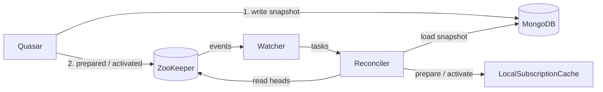
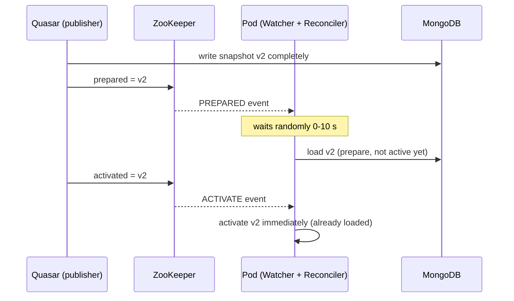
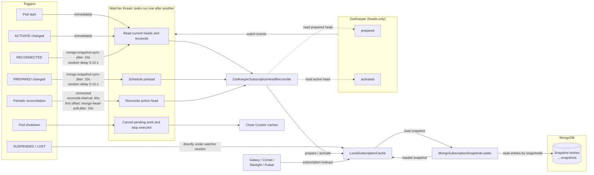

<!--
Copyright 2026 Deutsche Telekom AG

SPDX-License-Identifier: Apache-2.0
-->

# Local Subscription Cache

> **Document status:** This is the authoritative reference for the current local subscription cache behavior and configuration. The historical design plan in [local-subscription-cache-variant-2-plan.md](internal/local-subscription-cache-variant-2-plan.md) is superseded and is not normative. Outstanding operational follow-ups are tracked in [local-subscription-cache-open-items.md](internal/local-subscription-cache-open-items.md).

## Purpose

`LocalSubscriptionCache` provides a pod-local read cache for subscriptions. It prepares indexed lookup structures without
changing the active cache, then publishes the new state with one atomic reference update. It loads persisted snapshots
through `MongoSubscriptionSnapshotLoader`.

The existing Hazelcast-backed `JsonCacheService<SubscriptionResource>` remains unchanged. The Spring Boot autoconfiguration
selects the local cache as primary when enabled and can retain the existing service as fallback.

Applications access subscriptions through `SubscriptionCacheReader`. Its intentionally limited API exposes lookups by
subscription ID and by environment plus event type. The Shared Cache implementation translates the latter into a Hazelcast
`Query`; additional query shapes require an explicit implementation for every cache variant.

## Architecture

The class diagram below shows the main cache and reconciliation components.


```mermaid
classDiagram
    direction LR

    class SubscriptionCacheReader {
        <<interface>>
        +getById(subscriptionId)
        +findByEnvironmentAndEventType(environment, eventType)
        +isReady()
    }
    class LocalSubscriptionCache {
        -AtomicReference~CacheState~ cacheState
        -CompletableFuture~Void~ firstFreshSnapshot
        +prepare(snapshotHead)
        +activate(snapshotHead)
        +setActivationHead(head)
        +activationFailed(head)
        +disconnected()
        +status()
        +firstFreshSnapshot()
    }
    class CacheState {
        <<record>>
        -IndexedSubscriptionSnapshot activeSnapshot
        -IndexedSubscriptionSnapshot preparedSnapshot
        -SnapshotVersion activationHeadVersion
        -Status status
        -boolean activationHeadMustMatch
        -Instant staleSince
    }
    class Status {
        <<enumeration>>
        UNINITIALIZED
        FRESH
        STALE
    }
    class HazelcastCacheReader
    class FallbackSubscriptionCacheReader
    class IndexedSubscriptionSnapshot {
        <<record>>
        -SnapshotVersion version
        -subscriptionsById
        -subscriptionsByEnvironmentAndEventType
        ~empty()$
        ~fromSnapshotEntries(snapshotHead, entries)$
        ~snapshotId()
        ~getById(subscriptionId)
        ~findByEnvironmentAndEventType(environment, eventType)
        ~getAll()
        ~isEmpty()
    }
    class SnapshotVersion {
        <<record>>
        -String snapshotId
        -Long documentCount
        -Long revision
        -String sourceHash
        -Instant createdAt
        ~from(snapshotHead)$
        ~matches(other)
    }
    class SubscriptionSnapshotHead {
        +id
        +snapshotId
        +documentCount
        +revision
        +sourceHash
        +createdAt
    }
    class EnvironmentEventTypeKey {
        <<record>>
        environment
        eventType
    }
    class MongoSubscriptionSnapshotLoader {
        +load(snapshotHead)
    }
    class JsonCacheService~SubscriptionResource~
    class LocalSubscriptionCacheHealthIndicator {
        +health()
    }
    class ZooKeeperSubscriptionHeadWatcher {
        +start()
        +close()
    }
    class ZooKeeperSubscriptionSnapshotHeadReader {
        +readPrepared()
        +readActivate()
        +parsePreparedEvent(data)
    }
    class ZooKeeperSubscriptionSnapshotHeadParser {
        +parse(data)
    }
    class ZooKeeperSubscriptionHeadReconciler {
        -ActivationGate activationGate
        +run()
        +reconcileActiveHead()
        +preparePreparedEvent(data)
        +disconnected()
    }

    SubscriptionCacheReader <|.. LocalSubscriptionCache
    SubscriptionCacheReader <|.. HazelcastCacheReader
    SubscriptionCacheReader <|.. FallbackSubscriptionCacheReader
    LocalSubscriptionCache *-- CacheState : atomic state
    CacheState --> "1" IndexedSubscriptionSnapshot : activeSnapshot
    CacheState --> "0..1" IndexedSubscriptionSnapshot : preparedSnapshot
    CacheState --> "0..1" SnapshotVersion : activationHeadVersion
    CacheState --> Status : freshness
    IndexedSubscriptionSnapshot *-- EnvironmentEventTypeKey
    IndexedSubscriptionSnapshot --> "0..1" SnapshotVersion : version
    SnapshotVersion ..> SubscriptionSnapshotHead : created from
    LocalSubscriptionCache --> MongoSubscriptionSnapshotLoader
    HazelcastCacheReader --> JsonCacheService~SubscriptionResource~
    FallbackSubscriptionCacheReader --> LocalSubscriptionCache : primary
    FallbackSubscriptionCacheReader --> HazelcastCacheReader : fallback
    LocalSubscriptionCacheHealthIndicator --> LocalSubscriptionCache
    ZooKeeperSubscriptionHeadWatcher --> ZooKeeperSubscriptionHeadReconciler : events, reconnect, periodic, activation gate
    ZooKeeperSubscriptionHeadReconciler --> ZooKeeperSubscriptionSnapshotHeadReader : read heads
    ZooKeeperSubscriptionSnapshotHeadReader --> ZooKeeperSubscriptionSnapshotHeadParser : validate payload
    ZooKeeperSubscriptionHeadReconciler --> LocalSubscriptionCache : prepare/activate ZooKeeper head
```

`LocalSubscriptionCache` hält eine einzige `AtomicReference<CacheState>`. Der private, unveränderliche
`CacheState`-Record bündelt die Snapshot-Referenzen, die erwartete `activationHeadVersion`, den `Status`,
`activationHeadMustMatch` und `staleSince`:

- `preparedSnapshot` enthält den neu geladenen und validierten Snapshot. Er ist für Leser noch nicht sichtbar.
- `activeSnapshot` enthält den aktuell veröffentlichten Snapshot, den die Leseoperationen verwenden.

`SnapshotVersion` ist ein in `IndexedSubscriptionSnapshot` verschachtelter Record mit der Snapshot-Identität;
er enthält keine MongoDB-Head-Dokument-ID. `EnvironmentEventTypeKey` ist ebenfalls dort verschachtelt.
`Status` gehört zu `LocalSubscriptionCache`.
Das separate `firstFreshSnapshot`-Future hält fest, ob der Cache jemals `FRESH` war; ein späterer Wechsel zu
`STALE` setzt dieses Startup-Signal nicht zurück.

`prepare(snapshotHead)` erstellt aus den Snapshot-Einträgen einen neuen `IndexedSubscriptionSnapshot` mit den vorbereiteten
Lookup-Indizes. `activate(snapshotHead)` veröffentlicht diesen vorbereiteten Snapshot anschließend atomar als aktiven Snapshot.
`IndexedSubscriptionSnapshot` selbst entscheidet nicht über den Lebenszyklus und wird nach seiner Erstellung nicht mehr verändert.
Dadurch können Leser während des Vorbereitens weiterhin den alten vollständigen Snapshot verwenden und sehen nach der Aktivierung
entweder den vollständigen alten oder den vollständigen neuen Snapshot.

The ZooKeeper head watcher coordinates initialization and later updates through the `prepared` and `activate` heads.
ZooKeeper ACTIVATE is the only activation authority. There is no MongoDB-head polling or head fallback.
MongoDB supplies snapshot entries only. An unavailable ACTIVATE head marks the cache unconfirmed.

The `LocalSubscriptionCacheHealthIndicator` (endpoint `/actuator/health/localSubscriptionCache`) reports diagnostic
details and always returns `UP`, including when no subscription reader is ready. It does not change aggregate health
or pod probe behavior; `UP` alone is not proof that subscription reads are available.

| Method | Responsibility |
|---|---|
| `health()` | Always reports `UP`; details identify the effective reader (`local`, `fallback`, or `unavailable`). |

Health details, in this order:

| Detail | Meaning |
|---|---|
| `source` | `local`, `fallback`, or `unavailable`; health status remains `UP` in all cases |
| `fallbackMode` | Configured `fallback-mode` |
| `headSource` | Always `zookeeper` |
| `cacheStatus` | `UNINITIALIZED`, `FRESH`, or `STALE` |
| `localSnapshotId` | Active local snapshot; `none` before the first activation. Can be outdated when `source` is `fallback`. |
| `subscriptionCount` | Number of subscriptions in the active local snapshot |
| `activatedAt` | Last successful activation of the active snapshot, or `none` |
| `expectedSnapshotId` | Snapshot of the expected head; differs from `localSnapshotId` while the pod lags behind; `none` while no head source is available |
| `pendingSnapshotId` | Prepared snapshot that is not active yet, or `none` |
| `staleSince` | Only while `STALE`: time since when the cache is stale |
| `staleLocalReadsRemaining` | Only while `STALE` with `hazelcast-with-mongo-fallback`: remaining `stale-local-cache-read-grace-period` before reads use the fallback |

`LocalSubscriptionCacheMetrics` exposes the same state per pod as Prometheus metrics. Gauges are evaluated from
memory at scrape time; the counter is a single increment per fallback read.

| Metric | Type | Value |
|---|---|---|
| `horizon_local_subscription_cache_state` | Gauge | Current status: `0` = `UNINITIALIZED`, `1` = `STALE`, `2` = `FRESH` |
| `horizon_local_subscription_cache_local_reads` | Gauge | `1` if reads are served locally, `0` if the fallback is used |
| `horizon_local_subscription_cache_subscriptions` | Gauge | Subscriptions in the active snapshot |
| `horizon_local_subscription_cache_stale_seconds` | Gauge | Seconds since the cache became `STALE`, `0` otherwise |
| `horizon_local_subscription_cache_last_activation_timestamp_seconds` | Gauge | Epoch seconds of the last activation, `0` if none |
| `horizon_local_subscription_cache_snapshot_behind` | Gauge | `1` if an expected head is known and the active snapshot does not match it (snapshot identity rules, see below) |
| `horizon_local_subscription_cache_fallback_reads_total` | Counter | Reads served by the Hazelcast/MongoDB fallback (`hazelcast-with-mongo-fallback` only) |
| `horizon_local_subscription_cache_zookeeper_connected` | Gauge | `1` if the ZooKeeper head source is connected, otherwise `0` (ZooKeeper mode only) |
| `horizon_local_subscription_cache_failures_total{reason}` | Counter | `activation`: failed snapshot activations including failed snapshot loads; `zookeeper_head_read`: ZooKeeper `activate` head unreadable or missing while ZooKeeper is reachable (ZooKeeper mode only). Counts attempts, not incidents. |
| `horizon_local_subscription_cache_snapshot_load_seconds` | Timer | Count and total duration of successful snapshot loads from MongoDB |
| `horizon_local_subscription_cache_snapshot_load_last_seconds` | Gauge | Duration of the last successful snapshot load |

A Grafana dashboard for these metrics can be imported from
[local-subscription-cache-dashboard-v4.json](local-subscription-cache-dashboard-v4.json). Version 4 adjusts per-pod
stale-duration values to the query time, reducing differences caused by scrape timing.

The initializer does not coordinate the snapshot lifecycle and does not provide subscription lookup methods. Readers use
`SubscriptionCacheReader`, which delegates local lookups to the currently active snapshot.

Each snapshot contains two indexes:

| Index | Key | Value | Purpose |
|---|---|---|---|
| `subscriptionsById` | `subscriptionId` | one `SubscriptionResource` | Direct lookup by subscription ID |
| `subscriptionsByEnvironmentAndEventType` | `EnvironmentEventTypeKey(environment, eventType)` | list of `SubscriptionResource` | Lookup for event processing |

The maps and query result lists are structurally immutable. They cannot be changed through the cache API. The contained
`SubscriptionResource` objects are loaded from the MongoDB snapshot entries and remain mutable model objects; consumers
must treat them as read-only.

## Lifecycle

### Initial state

The active snapshot is empty after construction. When the local cache is enabled, the ZooKeeper head watcher
loads and activates the first snapshot during application startup; the
startup barrier decides whether startup waits for it.

- An empty snapshot is rejected by `activate(snapshotHead)`; the previous active snapshot remains unchanged.

### Prepare

Calling `prepare(snapshotHead)` performs the following steps:

1. Load all entries for the snapshot identified by the published head.
2. Validate every document.
3. Build the ID and environment/event-type indexes in local temporary maps.
4. Convert the maps and lists to unmodifiable collections.
5. Store the completed snapshot as `preparedSnapshot`.

The active snapshot is not modified during this process. If loading, validation, or index construction fails, readers continue
to use the previous active snapshot. A later successful `prepare()` replaces an earlier prepared snapshot. Preparation is
skipped when the head references the active or the prepared snapshot.

Head validation and identity (`SubscriptionSnapshotHeads`) apply to PREPARED and ACTIVATE metadata:

| Field | Validation | Identity ("same snapshot") |
|---|---|---|
| `snapshotId` | required, not blank | always compared |
| `documentCount` | required, `> 0` | always compared |
| `revision` | optional | compared only when set on both heads |
| `sourceHash` | optional | compared only when set on both heads |
| `createdAt` | required; ZooKeeper accepts any ISO-8601 offset (`Z`, `+02:00`) | not compared |
| `id` and unknown fields | ignored | not compared |

`SnapshotVersion.matches` applies these pairwise identity rules. The record's `equals` and `hashCode` compare all
stored fields, including `createdAt`, and are not used for lifecycle matching.

A changed `revision` or `sourceHash` with an unchanged `snapshotId` therefore triggers a reload, while a field missing in one
source does not. Invalid heads raise `SubscriptionCacheSnapshotException`.

### Subscription mapping

All read paths produce identical `SubscriptionResource` objects: Hazelcast JSON, local snapshot entries, and the MongoDB
fallback (when Hazelcast is offline) are all mapped with the same Jackson configuration
(`SubscriptionResourceJsonMapper.createObjectMapper()`, including the JSON filter operator (de)serializers).
MongoDB documents are read as raw BSON and converted to plain JSON first: dates become ISO-8601 strings, `Int64` and
`Decimal128` become JSON numbers, `ObjectId` becomes a string, and the MongoDB `_id` is ignored. No Spring Data entity mapping
or custom MongoDB converters are involved. A document that cannot be mapped fails the load (snapshot) or the read (fallback).

### Publisher and normal update flow

The normal publication path has distinct responsibilities:

| Component | Responsibility in a snapshot update |
|---|---|
| Quasar (publisher) | Writes a complete versioned snapshot to MongoDB, then publishes PREPARED followed by ACTIVATE. |
| MongoDB | Stores the complete snapshot entries. Any publisher-managed MongoDB head is not read by this cache. |
| ZooKeeper | Stores only the compact PREPARED and ACTIVATE heads and emits watch events; it does not store subscription entries. |
| Watcher (per pod) | Decides **when** work runs: observes head and connection events, coalesces/delays PREPARED work, and schedules reconciliation. |
| Reconciler (per pod) | Decides **what** happens: reads ZooKeeper heads, treats ACTIVATE as authoritative, reuses a matching prepared candidate or loads the ACTIVATE version, and marks an unavailable head unconfirmed. |
| `LocalSubscriptionCache` (per pod) | Keeps the prepared candidate invisible to readers and the current active snapshot; publishes a new snapshot atomically. |


```mermaid
flowchart LR
    Q[Quasar] -->|1. write snapshot| M[(MongoDB)]
    Q -->|2. prepared / activated| Z[(ZooKeeper)]
    Z -->|events| W[Watcher]
    W -->|tasks| R[Reconciler]
    R -->|read heads| Z
    R -->|load snapshot| M
    R -->|prepare / activate| C[LocalSubscriptionCache]
```

A normal update proceeds as follows:

1. Quasar writes all entries for a new snapshot version to MongoDB and publishes its PREPARED head to ZooKeeper.
2. Each pod handles PREPARED as a preload only. The randomized `mongo-snapshot-sync-jitter` spreads MongoDB loads across pods; the candidate remains invisible to readers.
3. Quasar publishes the ACTIVATE head after the version is ready to become authoritative. Only ACTIVATE authorizes activation.
4. Each pod compares the complete ACTIVATE metadata with its prepared candidate. A matching candidate can be activated without loading the entries again. If no matching candidate is available, the pod loads the ACTIVATE version from MongoDB.
5. The pod atomically switches its local active snapshot. Its readers see either the old or new complete snapshot; different pods may switch at slightly different times.

Because PREPARED processing is delayed and a later ACTIVATE event takes precedence over a still-pending preload, the warm path is an optimization, not a correctness requirement. The pod can load the ACTIVATE version directly when needed. This flow describes the publisher contract; the Spring Parent does not provide a cross-store transaction or guarantee cross-pod lockstep. Publisher ordering, snapshot durability, writer coordination, and end-to-end verification are external responsibilities.

### How the coordinator obtains the snapshot head

The coordinator must obtain a complete and valid `SubscriptionSnapshotHead` before calling `prepare(snapshotHead)`. The head is the
published commit marker for the snapshot and contains more than the snapshot ID, including the expected `documentCount`, `revision`,
and `sourceHash`.

The ZooKeeper reconciler reads the activation head from the `activate` ZNode. PREPARED metadata may authorize a preload,
but never activation. `prepare()` does not discover the current snapshot itself; it
loads and validates the exact head supplied by the caller.

Regardless of how the head is obtained, the lifecycle remains:

1. Obtain and validate the currently published `snapshotHead`.
2. `prepare(snapshotHead)` loads that snapshot and verifies its entry count before building indexes.
3. `activate(snapshotHead)` publishes the prepared snapshot to readers.

The coordinator must not use a hard-coded or stale snapshot ID as a substitute for the current head. Otherwise it could load an
outdated snapshot, miss metadata changes for a reused snapshot ID, or skip the document-count consistency check against the published
head.

### Activate

Calling `activate(snapshotHead)` verifies that the complete prepared metadata matches the supplied head and publishes it through
the `activeSnapshot` `AtomicReference`. Passing the complete head keeps preparation and activation tied to the same snapshot version;
comparing only the snapshot ID would not detect changed metadata for a reused ID.

The sequence below shows the normal warm path: Quasar publishes the snapshot and heads; each consuming pod coordinates locally
through its watcher and reconciler. The pod activates the preloaded candidate after ACTIVATE arrives.


```mermaid
sequenceDiagram
    participant Q as Quasar (publisher)
    participant Z as ZooKeeper
    participant P as Pod (Watcher + Reconciler)
    participant M as MongoDB
    Q->>M: write snapshot v2 completely
    Q->>Z: prepared = v2
    Z-->>P: PREPARED event
    Note over P: waits randomly 0-10 s
    P->>M: load v2 (prepare, not active yet)
    Q->>Z: activated = v2
    Z-->>P: ACTIVATE event
    P->>P: activate v2 immediately (already loaded)
```

This is the fast path, not a correctness dependency: if ACTIVATE arrives before a matching PREPARED snapshot is ready, the
reconciler loads the ACTIVATE version from MongoDB and then activates it. Readers continue to use the old active snapshot until
the new one is atomically published.

Activation without a prepared snapshot throws `IllegalStateException`. Empty snapshots are rejected as well. A prepared
snapshot remains available after activation. Repeated activation is idempotent only when all snapshot-head metadata is
unchanged; the same snapshot ID with changed metadata publishes the newly prepared snapshot.

## Read API

```java
Optional<SubscriptionResource> getById(String subscriptionId);

List<SubscriptionResource> findByEnvironmentAndEventType(
        String environment,
        String eventType
);
```

Reads:
- use only the current in-memory active snapshot;
- never access MongoDB or Hazelcast;
- do not acquire locks;
- observe either the complete old snapshot or the complete new snapshot;
- return empty results for unknown keys or `null` arguments.

Expected lookup complexity is $O(1)$ for both indexes, excluding iteration over the returned query result list.

## Validation and failure behavior

Preparation rejects:

- a `null` document;
- missing `spec` or `spec.subscription`;
- missing subscription ID;
- missing environment;
- missing event type;
- duplicate subscription IDs.

Any such failure prevents the new snapshot from becoming prepared. The active snapshot remains available and unchanged.

## Spring Boot integration

`LocalSubscriptionCacheAutoConfiguration` creates the cache only when the local cache is enabled. It requires the qualified
`mongoConfigTemplate` bean to read the snapshot head and entries.

MongoDB is normally enabled with:

```yaml
horizon:
  mongo:
    enabled: true
```

The bean is registered in addition to the existing `JsonCacheService`. A custom `LocalSubscriptionCache` or
`LocalSubscriptionCacheHealthIndicator` bean overrides the corresponding auto-configured bean.

An enabled local cache always uses ZooKeeper head coordination; the ZooKeeper connect string and distinct head paths
are required. MongoDB-only head polling and MongoDB-head fallback are not supported.

```yaml
horizon:
    cache:
        local-subscription-cache:
            enabled: true
            fallback-mode: hazelcast-with-mongo-fallback # or none
            snapshot-collection: subscriptions.subscriber.horizon.telekom.de.v1-snapshots
            mongo-load-timeout: 60s
            stale-local-cache-read-grace-period: 120s # Applies only to hazelcast-with-mongo-fallback
            require-local-cache-at-startup: true # Applies only to hazelcast-with-mongo-fallback; none always requires a local cache
            initial-snapshot-timeout: 15s
            reconcile-interval: 60s
            mongo-head-poll-jitter: 10s
            mongo-snapshot-sync-jitter: 10s
            zoo-keeper:
                ensemble-tracker-enabled: true
                connect-string: localhost:2181,localhost:2182,localhost:2183
                prepared-path: /horizon/subscriptions/prepared
                activate-path: /horizon/subscriptions/activated
                connection-timeout: 5s
                session-timeout: 30s
```

The service YAMLs and matching Helm helpers use service-prefixed environment variables:
`STARLIGHT`, `COMET`, `GALAXY`, or `PULSAR`, followed by `CACHE_LOCAL_SUBSCRIPTION_CACHE_`.
ZooKeeper client properties add `ZOO_KEEPER_`. For example, `stale-local-cache-read-grace-period` uses the
`STALE_LOCAL_CACHE_READ_GRACE_PERIOD` suffix.

### Head authority and migration

ZooKeeper ACTIVATE is the only head authority at startup and during operation. A missing, invalid or unreadable
ACTIVATE head, or a ZooKeeper disconnect, marks an active cache `STALE`; without an active snapshot it stays
`UNINITIALIZED`. Shared-data fallback and stale-read grace remain unchanged. Startup requiring a local cache fails
after `initial-snapshot-timeout` if no valid ZooKeeper ACTIVATE head and complete snapshot become FRESH.

Remove obsolete `mongo-head-fallback-mode`, `head-collection` and `zoo-keeper.enabled` settings and their
service-prefixed environment variables and Helm equivalents. They no longer select a mode or authorize fallback.
The `mongo-head-poll-jitter` name is retained for compatibility: it offsets the first periodic ZooKeeper head check,
not a MongoDB poll. Removing MongoDB-head publication from Quasar is a separate change requiring a consumer review.

### Configuration properties

All properties are located under `horizon.cache.local-subscription-cache`.

| Property | Default | Applies to | Description |
|---|---|---|---|
| `enabled` | `false` | all | Enables the pod-local cache. When `false`, no local-cache or ZooKeeper bean is created and reads use the shared Hazelcast reader. |
| `fallback-mode` | `hazelcast-with-mongo-fallback` | all | Read fallback when the local cache cannot serve reads. `none` uses only the local cache and never reads Hazelcast; stale local entries are then served indefinitely if necessary. |
| `snapshot-collection` | `subscriptions.subscriber.horizon.telekom.de.v1-snapshots` | all | MongoDB collection with the snapshot entries. |
| `mongo-load-timeout` | `60s` | all | Server-side time limit (`maxTimeMS`) for loading a snapshot. A timed-out load counts as failed activation. Does not cover unresponsive connections. Not mapped in the service YAMLs/Helm charts; override via `HORIZON_CACHE_LOCALSUBSCRIPTIONCACHE_MONGOLOADTIMEOUT` if needed. |
| `stale-local-cache-read-grace-period` | `120s` | `hazelcast-with-mongo-fallback` | How long a `STALE` local snapshot may still serve reads before the shared reader is used. `0s` switches immediately. With `none`, stale reads are unlimited. |
| `require-local-cache-at-startup` | `true` | `hazelcast-with-mongo-fallback` | When `true`, startup waits for the first `FRESH` local snapshot. When `false`, startup continues without waiting and without checking Hazelcast. `none` always waits. |
| `initial-snapshot-timeout` | `15s` | all, when startup waits | Maximum wait for the first local snapshot. Expiry fails startup and terminates the process; `0s` waits indefinitely. |
| `reconcile-interval` | `60s` | all | Interval for re-checking ZooKeeper ACTIVATE while connected. While disconnected, periodic checks do nothing. `0s` disables periodic runs. |
| `mongo-head-poll-jitter` | `10s` | all | Maximum random offset of the first periodic ZooKeeper head reconciliation; later runs keep the fixed interval. Historical name retained; no MongoDB head is read. |
| `mongo-snapshot-sync-jitter` | `10s` | ZooKeeper mode | Maximum random delay before loading a snapshot for `prepared` preloads and after a ZooKeeper reconnect. `0s` disables the delay. |
| `zoo-keeper.ensemble-tracker-enabled` | `true` | ZooKeeper mode | Lets Curator follow ZooKeeper-published ensemble addresses. Can be `false` for local operation, e.g. a local Docker ensemble reached through mapped ports. |
| `zoo-keeper.connect-string` | none | ZooKeeper mode | ZooKeeper connect string; required in ZooKeeper mode. |
| `zoo-keeper.prepared-path` | none | ZooKeeper mode | Absolute ZNode path of the `prepared` head, for example `/horizon/subscriptions/prepared`. |
| `zoo-keeper.activate-path` | none | ZooKeeper mode | Absolute ZNode path of the `activate` head, for example `/horizon/subscriptions/activated`. Must differ from `prepared-path`. |
| `zoo-keeper.connection-timeout` | `5s` | ZooKeeper mode | Curator connection timeout; also bounds each head read (`prepared`/`activate`), a timed-out read counts as `zookeeper_head_read` failure. Must be positive. |
| `zoo-keeper.session-timeout` | `30s` | ZooKeeper mode | ZooKeeper session timeout; the server may cap it (e.g. 40s). Must be positive. |

Curator tracks the ZooKeeper-published ensemble addresses by default (`ensemble-tracker-enabled: true`).
For a local Docker ensemble accessed from the host through mapped ports, set `ensemble-tracker-enabled: false`
in the local profile. This keeps the host-reachable `connect-string` for reconnects instead of switching to
Docker-internal names such as `zoo1:2181`. Leave tracking enabled when the published addresses are reachable.

### ZooKeeper watcher behavior

The Curator client and watcher are managed by Spring: both start with the application context and close on shutdown.
The watcher owns ZooKeeper subscriptions, connection-state handling, and task scheduling. Snapshot policy stays in the
reconcilers, while `LocalSubscriptionCache` owns the active snapshot and its freshness state.

| Component | Responsibility |
|---|---|
| `LocalSubscriptionCacheAutoConfiguration` | Validates the two paths, creates the Curator client, reader, reconciler, watcher, and lifecycle-managed beans. |
| `ZooKeeperSubscriptionHeadWatcher` | Starts both Curator watches, serializes reconciliation work on one daemon scheduler, applies event coalescing and jitter, handles connection transitions, and closes its watches and scheduler. |
| `ZooKeeperSubscriptionSnapshotHeadReader` | Reads the current `prepared` and `activate` ZNodes with a bounded wait; parses PREPARED event payloads. |
| `ZooKeeperSubscriptionSnapshotHeadParser` | Validates the JSON head contract without performing ZooKeeper I/O. |
| `ZooKeeperSubscriptionHeadReconciler` | Treats `activate` as the only authority, prepares/activates snapshots, preloads PREPARED snapshots, and marks unavailable ACTIVATE unconfirmed through the watcher gate. |
| `LocalSubscriptionCache` | Loads snapshot entries from MongoDB, validates and indexes them, atomically publishes snapshots, and tracks `UNINITIALIZED`/`FRESH`/`STALE`. |

The watcher trigger flow and component routing are shown below.


```mermaid
flowchart LR
    subgraph Triggers
        S[Pod start]
        A[ACTIVATE changed]
        C[RECONNECTED]
        P[PREPARED changed]
        D[SUSPENDED / LOST]
        T[Periodic reconciliation]
        X[Pod shutdown]
    end

    subgraph Thread["Watcher thread: tasks run one after another"]
        FULL[Read current heads and reconcile]
        PRE[Schedule preload]
        ACTIVE[Reconcile active head]
        CLOSE[Cancel pending work and stop executor]
    end

    subgraph ZK["ZooKeeper (heads only)"]
        ZP["prepared"]
        ZA["activated"]
    end

    RECONCILER[ZooKeeperSubscriptionHeadReconciler]
    LOADER[MongoSubscriptionSnapshotLoader]
    subgraph Mongo["MongoDB"]
        ME[(Snapshot entries<br/>...-snapshots)]
    end
    CACHE[LocalSubscriptionCache]
    SERVICES["Galaxy / Comet /<br/>Starlight / Pulsar"]
    STOP[Close Curator caches]

    S -->|immediately| FULL
    A -->|immediately| FULL
    C -->|mongo-snapshot-sync-jitter: 10s<br/>random delay 0-10 s| FULL
    P -->|mongo-snapshot-sync-jitter: 10s<br/>random delay 0-10 s| PRE
    D -->|directly under watcher monitor| CACHE
    T -->|connected<br/>reconcile-interval: 60s<br/>first offset: mongo-head-poll-jitter: 10s| ACTIVE
    X --> CLOSE --> STOP

    ZK -->|watch events| Thread

    FULL --> RECONCILER
    PRE --> RECONCILER
    ACTIVE --> RECONCILER
    RECONCILER -.->|read prepared head| ZP
    RECONCILER -.->|read active head| ZA
    RECONCILER -->|prepare / activate| CACHE
    CACHE -->|load snapshot| LOADER
    LOADER -->|read entries by snapshotId| ME
    LOADER -->|loaded snapshot| CACHE
    SERVICES -->|subscription lookups| CACHE
```

Reconciliation and load tasks are serialized by the watcher executor. Connection-state callbacks invalidate the epoch
and mark the cache unconfirmed under the same monitor used by the activation gate; they perform no MongoDB I/O.

The watcher uses these triggers:

1. **Startup:** It registers the Curator connection listener, starts both watches, then schedules the initial reconciliation. The reconciler reads the current PREPARED and ACTIVATE heads; ACTIVATE controls activation. The initial reconciliation runs asynchronously and is not jittered. The watcher's `initialReconciliation()` signals that this first callback completed while its connection epoch remained current; it does **not** guarantee a head existed or that the cache became `FRESH`. The separate startup barrier waits for `LocalSubscriptionCache.firstFreshSnapshot()` when configuration requires a fresh local cache.
2. **PREPARED change:** The watcher delays processing by a random value from zero through `mongo-snapshot-sync-jitter` (default: `10s`). A newer event cancels the previous task and replaces its payload, so only the latest pending event is prepared. A valid payload calls `prepare` only; it never activates the snapshot. Removing the ZNode discards the pending prepared snapshot. `0s` removes this delay.
3. **ACTIVATE change:** The watcher schedules reconciliation immediately and cancels a pending PREPARED task because ACTIVATE takes precedence. The reconciler reads both current heads, validates ACTIVATE, and prepares/activates its snapshot when the active snapshot is not already current. If ACTIVATE is already current, it can instead preload a distinct valid PREPARED head. If an ACTIVATE event arrives while reconnect reconciliation is pending, it performs the reconnect reconciliation immediately instead of waiting for the jitter timer.
4. **Periodic reconciliation:** `reconcile-interval` (default: `60s`) controls a fixed-delay check; the first check has a random offset up to `mongo-head-poll-jitter` (default: `10s`). While connected, it rereads only ACTIVATE, not PREPARED. While disconnected, it does nothing. `0s` disables only periodic checks; startup, events and reconnect remain active. Recovery from missed events then depends on a later event or reconnect.
5. **Disconnect and reconnect:** On `SUSPENDED` or `LOST`, the watcher cancels pending PREPARED/reconnect tasks and advances its connection epoch. The first connected-to-disconnected transition marks the cache unconfirmed directly under the watcher monitor. Repeated disconnect notifications do not restart grace. The reconciler commits `setActivationHead`, `activate` and missing-head state changes through the same monitor and only for the current running epoch. A load finishing after disconnect or an intervening reconnect cannot commit. On `RECONNECTED` (or `CONNECTED` after a failed initial connection), the watcher advances the epoch and schedules a full reread after a random delay up to `mongo-snapshot-sync-jitter`. A matching prepared or active snapshot is reused without reloading. `0s` removes the reconnect delay.
6. **Shutdown:** The watcher stops accepting work, cancels delayed tasks, removes the connection listener, shuts down its scheduler, waits briefly for running work, and closes both Curator caches. Spring separately closes the Curator client bean.

When ACTIVATE is missing, invalid, or unreadable, the reconciler marks the cache unconfirmed through the current-epoch
gate. ZooKeeper `SUSPENDED`/`LOST` marks it unconfirmed directly under the watcher monitor. An active cache becomes
`STALE`; without a snapshot it stays `UNINITIALIZED`. No MongoDB head is read. If the referenced snapshot cannot be
loaded or validated, the cache also becomes `STALE`.

Local reads require a `FRESH` snapshot unless the configured stale-read grace allows the last active snapshot temporarily.
Configure `stale-local-cache-read-grace-period` as a non-negative Spring `Duration` under `local-subscription-cache`
(default: `120s`). `0s` switches to the shared reader immediately. With fallback mode `NONE` there is no shared reader,
so a `STALE` local snapshot keeps serving reads indefinitely and the grace period does not apply. Repeated stale causes do
not restart the grace period; successful activation returns the cache to `FRESH` and clears it. After grace expiry the cache
remains `STALE`; only local-read eligibility changes. The health detail `source` follows the effective reader; health status
remains `UP`, even when the source is `unavailable`.

Startup waits for the first successfully activated, non-empty `FRESH` snapshot when a local
cache is required: always with fallback mode `NONE`, and with `hazelcast-with-mongo-fallback` only when
`require-local-cache-at-startup` is `true` (default). With `require-local-cache-at-startup: false`, startup continues
immediately without checking Hazelcast readiness. Configure `initial-snapshot-timeout` under `local-subscription-cache`
(default: `15s`); it limits only the wait for the local snapshot. If the deadline expires, application startup fails.
Set it to `0s` to wait indefinitely; a negative value is invalid. Spring publishes `ApplicationReadyEvent` only after
the barrier succeeds; Comet and Galaxy start their Kafka containers on that event, and Spring Boot readiness accepts
traffic only afterwards. Later cache transitions do not stop those listeners or change Kubernetes readiness: the cache
health indicator is not part of the readiness health group. Kubernetes readiness probes must use the Spring Boot
readiness health group, independently of liveness.

### Safeguards and fallback options

The mechanisms below protect different boundaries. Read fallback does not change the authoritative head source or
make two stores transactional, and does not guarantee the newest possible data.

| Mechanism | Protection | Boundary or trade-off |
|---|---|---|
| Startup freshness barrier: `require-local-cache-at-startup: true` (default) | Delays application readiness until a non-empty local snapshot has been loaded, validated, and activated as `FRESH`. `fallback-mode: NONE` always requires this barrier. | A positive `initial-snapshot-timeout` fails startup if freshness is not reached; `0s` waits indefinitely. Setting `require-local-cache-at-startup: false` permits startup without a fresh local cache and does not verify that the shared read fallback is ready. |
| PREPARED/ACTIVATE authority and snapshot validation | PREPARED may preload but cannot authorize publication. ACTIVATE is the only commit marker. Head identity and document count are checked before activation. | A failed snapshot load leaves the previous snapshot STALE. The publisher must ensure entries are durable before publishing ACTIVATE. |
| Prepare then atomic activate | A candidate is built separately from the active snapshot. Readers see the previous complete snapshot until a matching, non-empty candidate is atomically activated; failed preparation or activation does not expose a partial snapshot. | Atomicity is local to one pod. It does not coordinate activation across pods. |
| Disconnect fencing and reconnect reconciliation | Event generations and connection epochs reject stale scheduled work. The activation gate prevents a ZooKeeper load that finishes after `SUSPENDED`/`LOST` from being committed. Reconnect rereads current heads instead of relying on missed events. | This prevents an unconfirmed ZooKeeper head from being newly activated; it does not cancel an already executing MongoDB operation. |
| Read fallback: `fallback-mode: hazelcast-with-mongo-fallback` (default) | When the local cache cannot serve reads, the shared/Hazelcast reader is used; its existing MongoDB fallback applies if Hazelcast is unavailable. If both read paths fail, the request fails rather than returning a fabricated empty result. | This selects where reads come from, not which snapshot head is active. |
| Stale-read grace: `stale-local-cache-read-grace-period: 120s` (default) | Keeps the last active local snapshot available for a bounded period after the cache becomes `STALE`, then allows the shared read fallback to serve requests. | This favors availability over freshness during the grace period. With `fallback-mode: NONE`, stale local data is served indefinitely while an active snapshot exists; there is no alternate read source. |
| Periodic reconciliation: `reconcile-interval: 60s` (default) | Rechecks ZooKeeper ACTIVATE while connected and can recover from a missed event or transient read failure. No work while disconnected. | `0s` disables only the periodic safety check. Recovery then depends on a later watch event or reconnect. |

### Runtime scenarios

| Scenario | Local cache | Hazelcast/MongoDB fallback | Application startup | Health and readiness |
|---|---|---|---|---|
| Local snapshot loads and activates successfully | Ready | Not required | Succeeds | `UP`, source `local`; pod is ready |
| No local snapshot, `require-local-cache-at-startup: true` or fallback `NONE` | Not ready | Not used for startup | Waits; fails after a positive `initial-snapshot-timeout` | Pod does not become ready |
| No local snapshot, `require-local-cache-at-startup: false` | Not ready | Used for reads if ready | Succeeds without checking Hazelcast | Cache health `UP`, source `fallback` if ready, otherwise `unavailable`; pod readiness unaffected |
| ZooKeeper unavailable at bootstrap, local cache required | `UNINITIALIZED` | Not used for startup | Fails after a positive startup timeout | Pod does not become ready |
| ZooKeeper unavailable after activation | `STALE` | Shared fallback after grace; `none` keeps stale local reads indefinitely | Already running | Runtime readiness unchanged |
| Valid `activate` head with an invalid snapshot | `STALE` with previous snapshot | Used after the grace period | Already running | Source `local` during grace, then `fallback` |

### `prepare` and `activate` scenarios

The runtime scenarios above describe the complete pod behavior. The following table focuses on the two cache operations executed by
the pod coordinator:

| Operation | Scenario | Result | Active snapshot |
|---|---|---|---|
| `prepare` | Valid head and complete entries are available | Snapshot is validated, indexed, and stored as `preparedSnapshot` | Unchanged |
| `prepare` | Same head metadata is already prepared | Preparation is skipped | Unchanged |
| `prepare` | Same snapshot ID but changed metadata | Snapshot is loaded and prepared again | Unchanged |
| `prepare` | Invalid head, invalid entry, duplicate ID, or document-count mismatch | Operation fails; prepared snapshot is not replaced | Unchanged |
| `activate` | Prepared snapshot matches the complete supplied head and is non-empty | Prepared snapshot becomes active atomically | New snapshot |
| `activate` | No prepared snapshot exists | Operation fails with `IllegalStateException` | Unchanged |
| `activate` | Prepared snapshot does not match the supplied head | Operation fails with `IllegalStateException` | Unchanged |
| `activate` | Prepared snapshot is empty | Operation fails with `SubscriptionCacheSnapshotException` | Unchanged |
| `activate` | Supplied head matches the already active snapshot | Operation is idempotent | Unchanged |

When `local-subscription-cache.enabled` is `false`, no local-cache bean is created. The regular shared
`JsonCacheService` remains responsible for reads and its configured MongoDB fallback is used when Hazelcast is unavailable.

## Guarantees and boundaries

The implementation guarantees:

- atomic publication inside one pod;
- no partially built snapshot is visible to readers;
- lock-free in-memory reads;
- preservation of the previous active snapshot when preparation fails;
- rejection of empty snapshots before they become active;
- no behavioral change to `JsonCacheService`.

The implementation does not provide:

- cross-pod activation coordination;
- checksum or activation-time handling;
- deep immutability of `SubscriptionResource` objects.

Freshness-based fallback is provided: a `STALE` local snapshot serves reads only during
`stale-local-cache-read-grace-period`, then the shared reader is used (`hazelcast-with-mongo-fallback`).

These concerns remain with the consuming pod or a future coordination component.